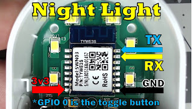
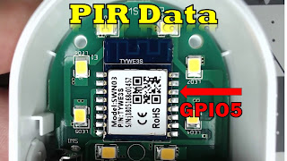

<iframe allowfullscreen data-thumbnail-src="https://i.ytimg.com/vi/5Oa27pCHtYo/0.jpg" frameborder="0" height="266" src="https://www.youtube.com/embed/5Oa27pCHtYo?feature=player_embedded" width="320"></iframe>

  
  
How to make a Smart Motion Sensor out of a Night Light Smart Plug.  An excellent solution to easily put a motion sensor in a room where you couldn't before for automated lights. You also get a night light and smart plug in the same package for less than $20!  
  
**Parts List**  
Smart Plug - [iMah](https://amzn.to/2FbuVWl) or [iClever](https://amzn.to/2Rxedaw)   
PIR Motion AM312 Sensor - [2 pack](https://amzn.to/2DhrkpA) or [1 pack](https://amzn.to/2F7P9lE)   
  
[Soldering Iron Station](https://amzn.to/2DwJpiW)  
[Helping Hands(as shown)](https://amzn.to/2C2iclH)  
[Better Helping Hands](https://amzn.to/2Q3tKhI)  
[0.015 Solder](https://amzn.to/2OQDd74)  
[Female Jumper Wires](https://amzn.to/2DcCiMX)  
[USB FTDI for Flashing](https://amzn.to/2Ke2V4W)  
  
  

  
(click the pic to zoom)

[](https://2.bp.blogspot.com/-aehzaNf8aAA/XDI356cUk4I/AAAAAAAD7j4/5N2Qfo5CfMkbBb6bRcd1ov4B6ISe93cywCLcBGAs/s1600/Pinout_Slide.jpg)

  

[](https://4.bp.blogspot.com/-r_pz-22Otf4/XDI37coUt6I/AAAAAAAD7j8/_ghpeEjc9EoJyb0T7YOMb8duMELk2duZQCLcBGAs/s1600/PIRData_Slide.jpg)

  

  

  

**Home Assistant Configuration YAML - Samples**

```yaml

switch:
  - platform: mqtt
    name: "MotionNite Switch"
    state_topic: "stat/MotionNite1/POWER1"
    command_topic: "cmnd/MotionNite1/POWER1"
    availability_topic: "tele/MotionNite1/LWT"
    qos: 1
    payload_on: "ON"
    payload_off: "OFF"
    payload_available: "Online"
    payload_not_available: "Offline"
    retain: false

binary_sensor:
  - platform: mqtt
    name: "MotionNite PIR"
    state_topic: "MotionNite1/PIR"
    availability_topic: "tele/MotionNite1/LWT"
    qos: 1
    payload_on: "1"
    payload_off: "0"
    payload_available: "Online"
    payload_not_available: "Offline"
    device_class: motion

light:
  - platform: mqtt
    name: "Motion Night Light"
    state_topic: "stat/MotionNite1/POWER2"
    command_topic: "cmnd/MotionNite1/POWER2"
    availability_topic: "tele/MotionNite1/LWT"
    brightness_state_topic: "stat/MotionNite1/RESULT"
    brightness_command_topic: "cmnd/MotionNite1/Dimmer"
    brightness_scale: 100
    brightness_value_template: "{{ value_json.Dimmer }}"
    qos: 1
    payload_on: "ON"
    payload_off: "OFF"
    payload_available: "Online"
    payload_not_available: "Offline"
    retain: false
```