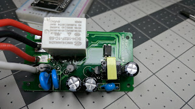
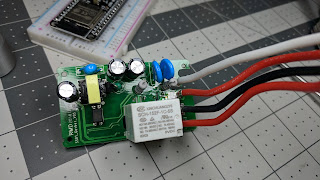
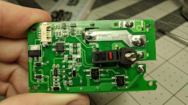

  

<iframe allowfullscreen data-thumbnail-src="https://i.ytimg.com/vi/9LIaDN7Nx2E/0.jpg" frameborder="0" height="266" src="https://www.youtube.com/embed/9LIaDN7Nx2E?feature=player_embedded" width="320"></iframe>

  
  
  
  
It's here!  A smart switch that works in several different 3 way wiring configurations without any rewiring or other tricks.  Swapping out one of the 3 way switches with this one is the only requirement.  This video also shows the details of using with Tasmota for local MQTT control with Home Assistant.  
  
[Purchase 3-Way Smart Switch](https://amzn.to/2LieyNh)  
  
**Additional Parts for Flashing Tasmota if Needed**  
[Soldering Iron Station](https://amzn.to/2DwJpiW)  
[Helping Hands(as shown)](https://amzn.to/2TqQZ3M)  
[Alternative Upgraded Helping Hands](https://amzn.to/2Q3tKhI)  
[0.015 Solder](https://amzn.to/2OQDd74)  
[Female Jumper Wires](https://amzn.to/2DcCiMX)  
[USB FTDI for Flashing](https://amzn.to/2Ke2V4W)  
  
[Amazon US Link](https://amzn.to/2LieyNh)  
  
**Updated with templates for the new Tasmota version**  
  
Setup your MQTT Configuration first  
  
**Tasmota Setup Commands (copy and paste each section to one line in the Tasmota Console)**  
  

[Setup and Configuration Page Consolidated Here](https://www.digiblur.com/p/treatlife-3-way-switch-ss01-ss02-setup.html)  
  
**Additional Links**  
[Excellent guide with various 3 way wiring configurations](https://www.easy-do-it-yourself-home-improvements.com/3-way-switch-wiring-diagram.html)  
[Tasmota Releases](https://github.com/arendst/Sonoff-Tasmota/releases)  
[Flash ESP8266](https://github.com/letscontrolit/ESPEasy/releases)  
[Termite Terminal App](https://www.compuphase.com/software_termite.htm)  
  
Internal Pictures  
  

  

  

