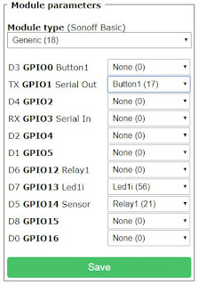

<iframe allowfullscreen data-thumbnail-src="https://i.ytimg.com/vi/O5GYh470m5k/0.jpg" frameborder="0" height="266" src="https://www.youtube.com/embed/O5GYh470m5k?feature=player_embedded" width="320"></iframe>

  
You heard correctly, flash all of your SmartLife Tuya App devices with no soldering at all.  Flash them while you can before devices are updated.  All you need is a Raspberry Pi 3 to flash your devices with Tasmota.  No soldering at all and you will have full local control unlocking the true power of your smart devices.  
  
**UPDATE:** Be very careful that you put in the correct SSID and Password.  It might not be a bad idea to put in a simple backup SSID and Password in position 2.  If for some reason you mistype the slot 1 password you could always change your WiFi router to send out the simple SSID and password in slot 2 to fix the issue with slot 1.  Also once you get into the switch/plug Tasmota GUI, I would highly recommend changing the WiFi Config tool to WiFi Manager by typing "wificonfig 2" (without the quotes on the console), it should respond back with that WiFiManager is selected.  This will make the device go into access point mode anytime there is an issue with connecting to the wifi.  
  
**Parts List**  
[Raspberry Pi 3](https://amzn.to/2SfpDQM)  
[32gb Micro SD Card](https://amzn.to/2MwYVNY)  
[Moes 3-Way Smart Switch(optional)](https://amzn.to/2S3sPPd)  
[4 pack Smart Plugs(optional)](https://amzn.to/2G2YhXi)  
[Fliirc Case (optional: great RPi heat sink case)](https://amzn.to/2MB8KKI)  
  
**Other Tuya based favorites**  
[Night Light 2 pack](https://amzn.to/2FbuVWl) or [Night Light 1 Pack](https://amzn.to/2Rxedaw)   
[Martin Jerry Dimmer](https://amzn.to/2L8XeFS)  
[Oittm/Lopoo/Moes Dimmer](https://amzn.to/2PvO1bm)  
[SK03 Outdoor Smart Plug (w/Power Monitoring)](https://amzn.to/2RIf8kO)  
[KULED SmartSwitch](https://amzn.to/2JqvWd6)  
[Martin Jerry Switch](https://amzn.to/2qowzv3)  
  
[Amazon US Link](https://amzn.to/2DDNYI4)  
**Software and Github Links**  
[Etcher](https://www.balena.io/etcher/)  
[Raspbian Stretch Lite](https://www.raspberrypi.org/downloads/raspbian/)  
[Putty (SSH)](https://www.chiark.greenend.org.uk/~sgtatham/putty/latest.html)  
[Tuya Convert Github](https://github.com/ct-Open-Source/tuya-convert)  
  
**Raspberry Pi Commands for Copy & Paste**  
sudo raspi-config  
sudo apt-get update  
sudo apt-get dist-upgrade  
sudo apt-get install network-manager  
sudo apt install git  
  
Thanks to VTRUST for their contribution page on GitHub on this project!  
  
Per Request, GPIO Configuration for the Smart Plugs linked above  
  

