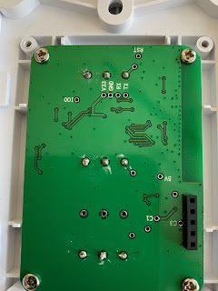
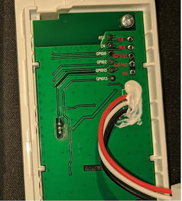
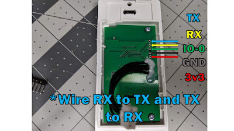
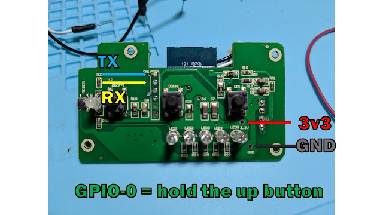
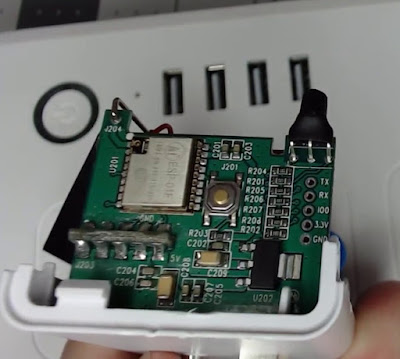
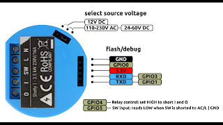
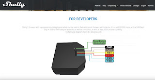
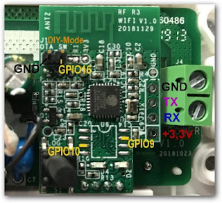
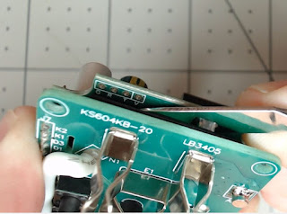

  

<iframe allowfullscreen data-thumbnail-src="https://i.ytimg.com/vi/QQIEu_kzkR8/0.jpg" frameborder="0" height="266" src="https://www.youtube.com/embed/QQIEu_kzkR8?feature=player_embedded" width="320"></iframe>

  
  
Tuya Convert got you down?  Still looking for some devices that don't require soldering to flash your Tasmota, ESPHome, etc open source firmware?  We are checking out a few devices that can be flashed with the open pin headers.  No soldering!  If you have any devices to add to the list be sure to comment down below.  They will get added along with pictures of the pin headers on this Blog post.  Let's build the list and make all of our devices ours with pure local control!  
  
**Solderless Devices**  
[Zemismart - 1,2, or 3 Switch](https://amzn.to/33wAdFK)  
  
They refer to them as gangs, but there are three models based on how many switches you want. They are clickie style switches and fit in a standard US 1 gang width box.  Remove the 4 screws on the back and you'll see the pins all right there.  IO0 is the GPIO 0 pin.  
  

  
[Sonoff iFan03](https://amzn.to/2YtKu6J)  
  
The button is GPIO0 - hold the button while applying power for a few seconds, just like the Sonoff Basic  
  

  
  
  
  
[Etekcity Switch 2 Way](https://amzn.to/2YNK2LZ)  
  

  
  
[Etekcity Switch 3 Way](https://amzn.to/2KxLZ9X)  
  

  
  
[Martin Jerry Switch 2 Way](https://amzn.to/2KmceBE)  
  

  
  
[Martin Jerry Dimmer](https://amzn.to/31mfItq)  
  

  

  
Uses the digiDIM forked bin from [here for the MJ-SD01 Dimmer](https://github.com/digiblur/Sonoff-Tasmota/blob/development/README.md)  
  
[Acenx Dimmer](https://amzn.to/31jbMcI)  
  
Same as the MJ Dimmer above - just a different faceplate  
  
[Etekcity Smart Plug](https://amzn.to/2YRTlKV)  
  

  
  

[Shelly 1](https://amzn.to/2YRT1eN)  
  
[Shelly 1(Non US)](https://shelly.cloud/shelly1-open-source/?ref=25157)    
  

  
  

[Shelly 2.5](https://amzn.to/2KiEJQz)  
[Shelly 2.5(Non US)](https://shelly.cloud/shelly-25-wifi-smart-relay-roller-shutter-home-automation/?ref=25157)  
  

  
  

[Sonoff Basic](https://amzn.to/2GPsita)  
  

  
  

[Smart Socket](https://amzn.to/2YM8qgV)  
  
Process shown in video above  
  

  
  
**Parts/Items in the Video**  
[CH340G USB Flasher](https://amzn.to/2YMMm5J)  
[Jumper Wires](https://amzn.to/2KhPkLs)  
  
**Addt'l Links**  
Tasmota - [https://github.com/arendst/Sonoff-Tasmota](https://github.com/arendst/Sonoff-Tasmota)  
NodeMCU Pyflasher - [https://github.com/marcelstoer/nodemcu-pyflasher](https://github.com/marcelstoer/nodemcu-pyflasher)  
  
[Products I use and recommend on Amazon](https://www.amazon.com/shop/digiblurdiy)   
  
**Come chat with us!**  
Discord - [https://discord.gg/bNtTF2v](https://discord.gg/bNtTF2v)  
Patreon - [https://www.patreon.com/digiblurDIY](https://www.patreon.com/digiblurDIY)
