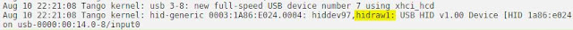
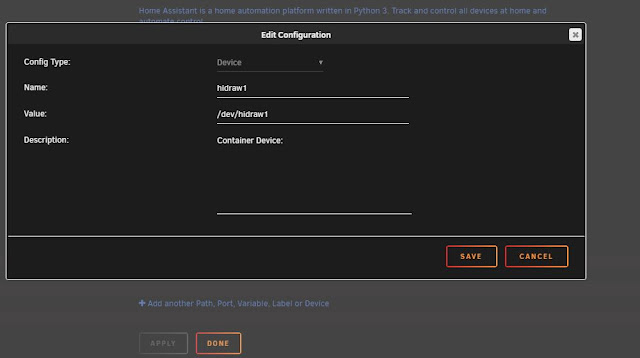

<iframe width="320" height="266" data-thumbnail-src="https://i.ytimg.com/vi/19UCwf4uidQ/0.jpg" src="https://www.youtube.com/embed/19UCwf4uidQ?feature=player_embedded" frameborder="0" allowfullscreen></iframe>

  
  
Easy to deploy and reliable sensors for automations on doors, cabinets, freezers, toilet seats (we know who!), etc, check out the Wyze Sense pack.  By popular demand after the live stream we are doing a quick and easy step by step setup with Home Assistant.  This was tested on a Raspberry Pi 4 (which runs pretty quick!) but you can install this on many device setup types, such as unRaid, docker, etc.  
  
[Wyze Sense Pack w/ Camera](https://amzn.to/2GWcIfG)  
[Wyze Sense Pack Only](https://www.wyze.com/wyze-sense/)  
  
[Raspberry Pi 4 Kit](https://amzn.to/31pURoU)  
  
**Addtl Links**  
Wyze Component - https://github.com/kevinvincent/ha-wyzesense  
HACS Install - https://custom-components.github.io/hacs/installation/manual/  
DrZzs Install of HACS - https://www.youtube.com/watch?v=aJTTCAvzpIU  
  
[Products I use and recommend on Amazon](https://www.amazon.com/shop/digiblurdiy)  
  
**Come chat with us!**  
Discord - https://discord.gg/bNtTF2v  
Patreon - https://www.patreon.com/digiblurDIY  
  
**unRaid `hidraw<x>` Passthrough**  
  
This is for folks running separate docker containers and not using the Hassio Supervisor  
  
Plug in the Waze USB receiver, log into the unRaid GUI and check the system log to see the number that hidraw installed as. (click the graphic below for a larger view)  
  

  
Go to the Docker tab, find your "home-assistant" container and click edit.  Click "+Add another Path, Port..." button.  
  

  
Click Save, then Done, and the Docker container will be stop and updated with the new pass through.  Follow through with adding the `hidraw<x>` number you had to the configuration.yaml.  That's it!
