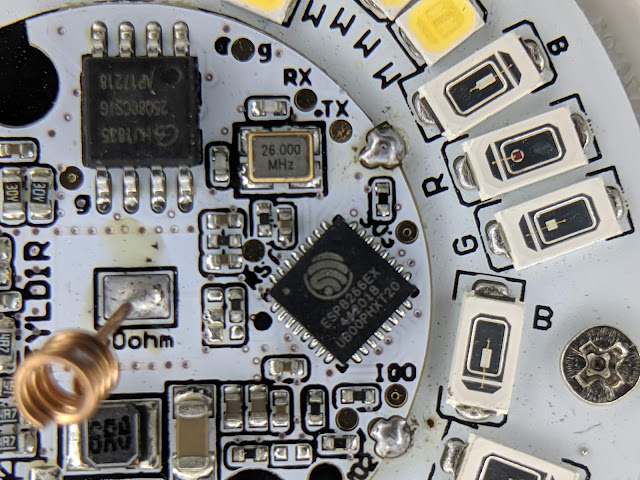
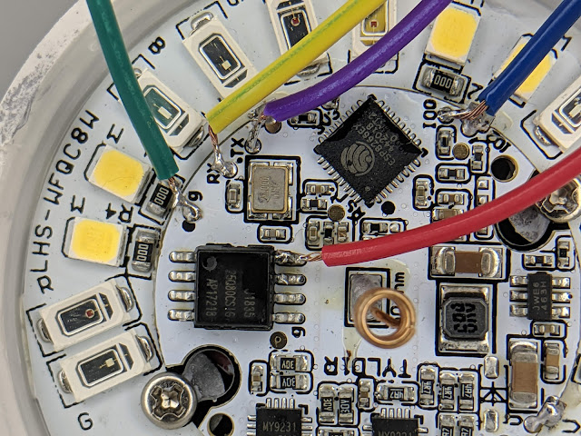

  
First you may ask why do we need this if we can currently do these with Tuya Convert?  Pay attention to that word "currently".  You can never beat the tried and true method of connecting up those RX/TX lines via serial to flash your ESP82xx devices.  99.9% of the time it just works!  If you have any issues or firmware corruption it is stupid simple to just recover your device.   
  
Luckily the quite awesome performance to cost ratio [bulbs](https://amzn.to/2MUqCSQ) that Lohas provides they also have the RX/TX pins exposed for us right on top under the diffuser.  That's quite rare in a bulb, especially in one of my favorite bulbs!  The only issue I've found is the 3v3 pin does not work!  But no fear!  It is easy to solder to the 3v3 pin on the flash memory chip.   
  
First apply a bit of flux to each pad you will be soldering to then apply a small bulb of solder to the pads.   
  
Next take a dupont jumper wire and cut off the ends.  Apply a small amount of flux and then tin them with solder.   
  
Then simply apply heat to the pad and pre-tinned wire and it pulls right together.  The dupont wire flexes easily as well to prevent the pad from being ripped off the bulb.  Take your time and do not use to much heat!  I've attached some pictures for reference of where the memory pin is to provide power.   
  
[4 Pack Lohas RGBW Light Bulbs](https://amzn.to/2MUqCSQ)  
  
**DO NOT APPLY MAINS POWER TO THE BULB WHILE YOU HAVE THESE WIRES CONNECTED!**  
  

  
  
  
  

