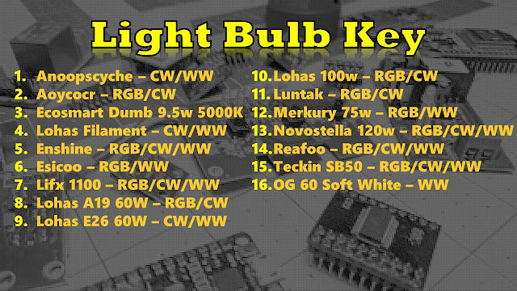

<iframe width="320" height="266" data-thumbnail-src="https://i.ytimg.com/vi/MnmUPF5rRro/0.jpg" src="https://www.youtube.com/embed/MnmUPF5rRro?feature=player_embedded" frameborder="0" allowfullscreen></iframe>

  
  
The Extensive Smart Light Comparison of 2019 | Teardowns included at the End  
  
We spent quite a bit of time setting up 15+ bulbs, photographing, videoing them and testing out each channel with LUX sensors.  All the data and video has been compiled for you to make your own decisions, although I do tell you which bulb is my favorite based on various factors/features.  
  
**Bulbs**  
[Lohas A19 60W RGBW](https://amzn.to/347KkA8)  
[Lohas A19 E26 CW/WW](https://amzn.to/2Nv3WYt)  
[Lohas A21 100W RGBW](https://amzn.to/36c2yCD)  
[Edison Tunable E26 CW/WW](https://amzn.to/2MPKbLS)  
[Novostella 120W A19](https://amzn.to/34gUJtF)  
[Reafoo E26](https://amzn.to/2MUKXrf)  
[Anoop 60W CW/WW](https://amzn.to/2WhIQkc)  
[Aoycocr A19 750lm](https://amzn.to/347DYRg)  
[Enshine A19 60W](https://amzn.to/2piEwoO)  
[Esicoo 60W](https://amzn.to/2PnwkhJ)  
[Luntak E26 60W](https://amzn.to/2pWlfcR)  
[Merkury A21 75W](https://bit.ly/2PyBzeH)  
[Teckin SB50](https://amzn.to/2PoD5jp)  
[Lifx A19 1100lm](https://amzn.to/2Pm2qKz)  
  
[Google Spreadsheet of Smart Lights](https://docs.google.com/spreadsheets/d/12CZx8fF18soyQO9aFBtrTnKBg8zVQiPoT9uK6ioK2Vk/edit?usp=sharing)   
  

  
  

  

  

  

  

  
\-=-=-=-Get the Products We Use/Recommend-=-=-=- 
Amazon US - [https://amzn.to/2YZNDeO](https://amzn.to/2YZNDeO)  
Amazon UK - [https://amzn.to/2TnG2R4](https://amzn.to/2TnG2R4)  
Amazon CA - [https://amzn.to/2HchPZe](https://amzn.to/2HchPZe)  
  
\-=-=-=-Come chat with us!-=-=-=- 
Discord - [https://discord.gg/bNtTF2v](https://discord.gg/bNtTF2v)  
Patreon - [https://www.patreon.com/digiblurDIY](https://www.patreon.com/digiblurDIY)  
  
Links to products provided through the Amazon Affiliate program.
