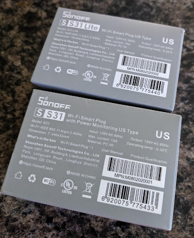
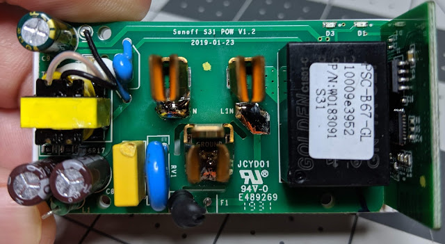
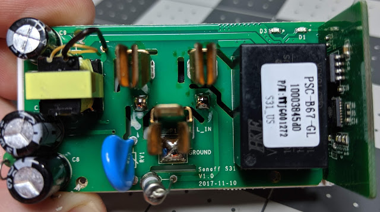
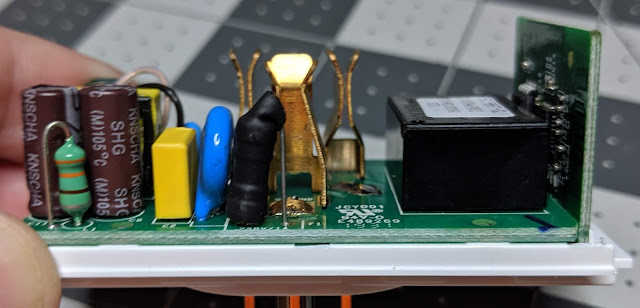
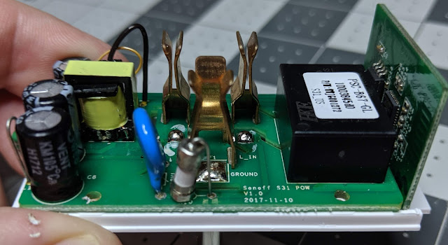
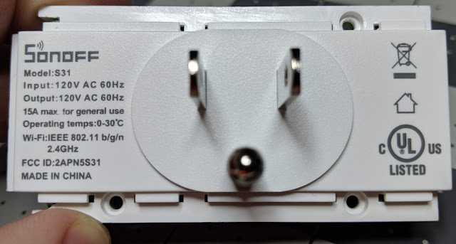
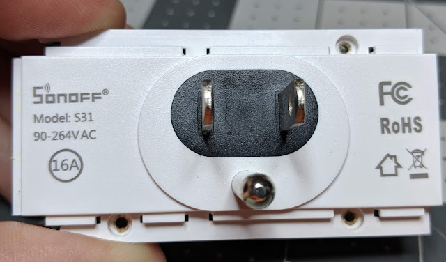
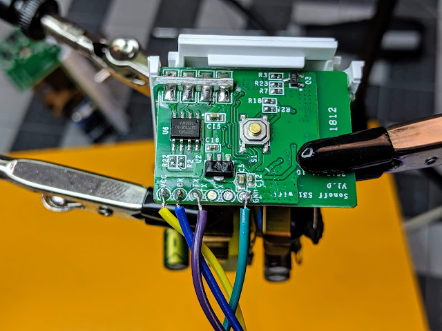
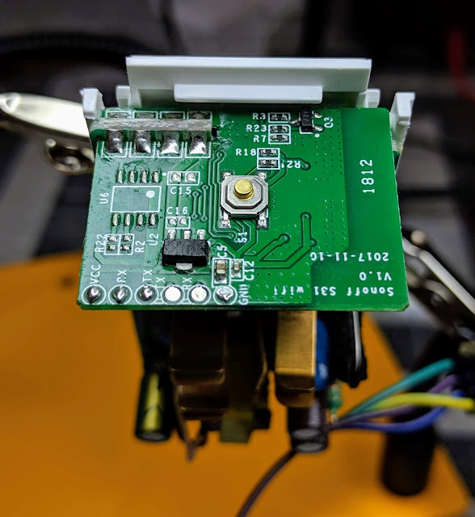

  
I recently picked up the [Sonoff S31](https://amzn.to/2p1jU4o) and [Sonoff S31 Lite](https://amzn.to/32qnnqT) smart plugs that are UL Listed.   They new S31's bear the UL listed logo on the box and the back of the unit itself.  Let's crack them open and see what makes them tick.  
  

  
  
The Lite version is the same plug except it does not bring any power monitoring capabilities to the table.  With all new hardware revisions of various products I was worried that my favorite smart plug was going to go the way of the Sonoff Mini and not have any easy access headers for flashing the open source firmware of your choice.  The Sonoff S31 line of plugs easily fit two plugs on the same wall socket with ease, utilizes screws in case you want to open the device, and has easy to solder RX/TX pin headers; which is why the S31 is still my favorite smart plug!  
  
Of course I took the device apart and compared it to the previous non-UL S31 model (pics below).  I was excited to see they kept the same PCB that handles the ESP8266 side of things which meant the header is still there!  Remove the three screws and flash away with no worries of ever bricking the device since you can always recover it.  We aren't so lucky with many other plugs on the market that have to destroyed and/or cut up to get to the RX/TX pads.   
  
I'm not going to go into the deep rabbit hole debate of ETL, UL listings, CE, etc, but if you require your smart plugs to be UL Listed then these are definitely the way to go!  
  
Amazon Link to [Sonoff S31](https://amzn.to/2WQ6ioS)  
  
 **Sonoff S31 UL**  
  

**Sonoff S31 Non-UL**

 

**Sonoff S31 UL**   

  

**Sonoff S31 Non-UL**

  
**Sonoff S31 UL**  

**Sonoff S31 Non-UL**

  
And of course we soldered RX/TX leads to them and flashed it with Tasmota.  The GPIO pinout is the same and the Sonoff S31 Module option in Tasmota worked great.  
  

  
The Sonoff S31 Lite is the same PCB but without the power monitoring chip.  
  

  
And as always, both plugs fit with a small air gap in between when you plug them into the same socket.  

