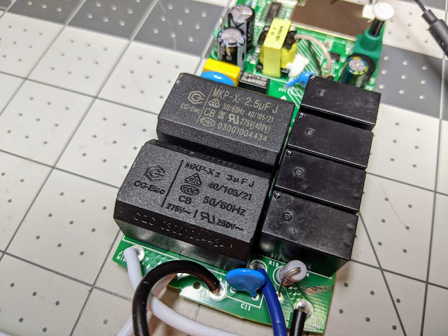
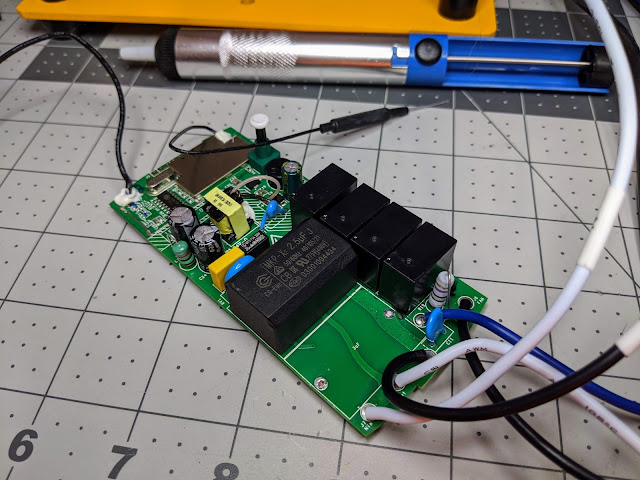
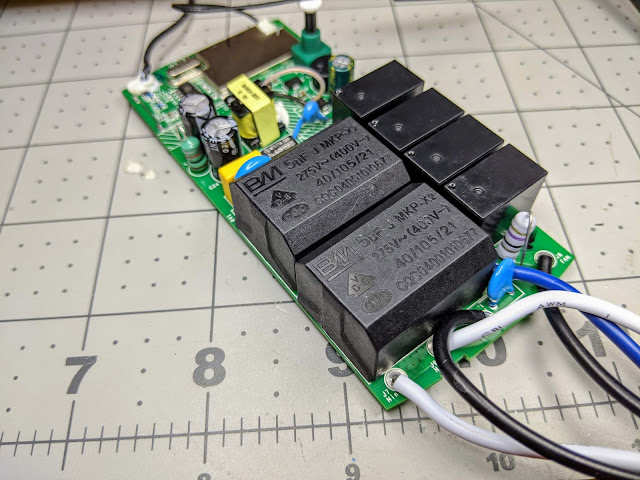

<iframe allowfullscreen data-thumbnail-src="https://i.ytimg.com/vi/XCEPluSvLv8/0.jpg" frameborder="0" height="266" src="https://www.youtube.com/embed/XCEPluSvLv8?feature=player_embedded" width="320"></iframe>

  
  
Utilizing two dimmers in a 3 way configuration or even a standard 2 way, you can control the iFan03 with full speed and light control from the wall.  You also get visual and audio representation of the fan speeds and not to mention the remote still works!  
  
**Products Used**  
[Sonoff iFan03](https://amzn.to/2MqfzAi)  
[Martin Jerry Dimmer](https://amzn.to/2ZmvIfc)  
[Acenx Alternate Faceplate Dimmer](https://amzn.to/2tPNxrp)  
[iFan03 (Aliexpress)](http://s.click.aliexpress.com/e/n9JQcJEg)  
  
[5uF Capacitors (10 pcs)](https://ebay.to/2sj16yX)  
[5uF Capacitors (2 pcs)](https://ebay.to/2F1HwKF)  
Links provided by eBay Partner Network.  
Yes the caps fit without modifying the board or case! See below for pics.  
  
Tuya-Convert Process - [https://www.youtube.com/watch?v=dyUyewiKpRA](https://www.youtube.com/watch?v=dyUyewiKpRA)  
Martin Jerry Dimmer Fork and Setup - [https://github.com/digiblur/Tasmota](https://github.com/digiblur/Tasmota)  
Smart Bulb Project Mentioned - [http://www.hackspace.io/?p=327](http://www.hackspace.io/?p=327)  
  
If you use the below rules with the "if" commands, a Tasmota bin compiled with Expressions/If commands is required.  Install the full-rules bin file [here](https://github.com/Jason2866/Tasmota-specials/tree/firmware/firmware/tasmota/other)   
  
**Rules (iFan03)**  
  
_Rule1 on fanspeed#data=0 do backlog buzzer 1,5 ; publish cmnd/fandims/dimmer 0 endon_  
 _on fanspeed#data=1 do backlog buzzer 1,1 ; publish cmnd/fandims/dimmer 10 endon_  
 _on fanspeed#data=2 do backlog buzzer 2,1 ; publish cmnd/fandims/dimmer 50 endon_  
 _on fanspeed#data=3 do backlog buzzer 3,1 ; publish cmnd/fandims/dimmer 100 endon_  
_Rule2 on power1#state do publish LRoom/Toggle endon_  
 _on fanspeed#data do var1 %value% endon_  
_Rule3 on event#togfan do if (var1>0) fanspeed 0 endif endon_  
 _on event#togfan do if (var1==0) fanspeed 2 endif endon_  
**Rules (MJ Dimmer)**  
  
_Rule1_   
 _on switch1#state=2 do publish LRoom/Toggle endon_  
 _on switch2#state=2 do publish cmnd/DLight\_LRoom/dimmer - endon_  
 _on switch3#state=2 do publish cmnd/DLight\_LRoom/dimmer + endon_  
_Rule2_  
 _on switch1#state=3 do publish cmnd/Fan-LRoom/event togfan endon_  
 _on switch2#state=3 do publish cmnd/Fan-LRoom/fanspeed - endon_  
 _on switch3#state=3 do publish cmnd/Fan-LRoom/fanspeed + endon_  
_Rule3_  
 _on power1#state=1 do ledpower 0 endon on power1#state=0 do ledpower 1 endon_  
  
**Get the Products We Use/Recommend**  
Amazon US - [https://amzn.to/2YZNDeO](https://amzn.to/2YZNDeO)  
Amazon UK - [https://amzn.to/2TnG2R4](https://amzn.to/2TnG2R4)  
Amazon CA - [https://amzn.to/2HchPZe](https://amzn.to/2HchPZe)  
  
**Come chat with us!**  
Discord - [https://discord.gg/bNtTF2v](https://discord.gg/bNtTF2v)  
Patreon - [https://www.patreon.com/digiblurDIY](https://www.patreon.com/digiblurDIY)  
  
Links to products provided through the Amazon Affiliate program.  
  

