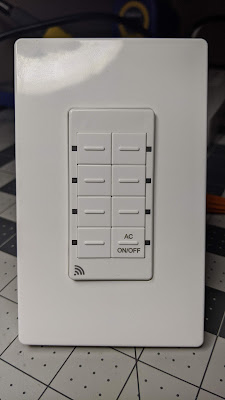
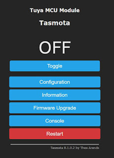
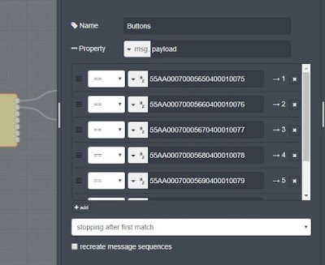
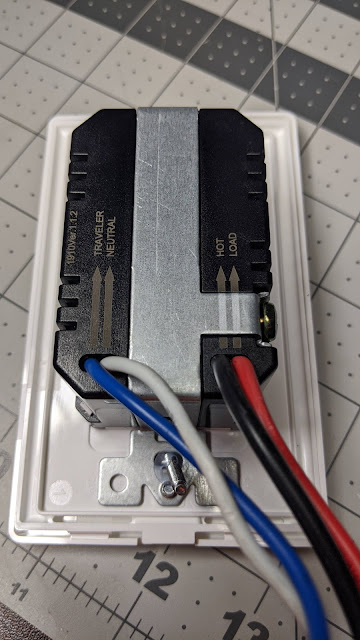
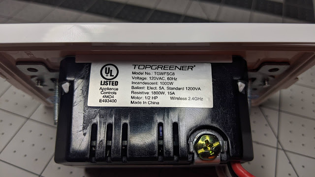

  

Skip to the nonsense and just buy the thing here on Amazon: [https://amzn.to/2S9MFpX](https://amzn.to/2S9MFpX)

  
In my weirdo tech geek cruising of FCC certifications I stumbled upon an interesting [8 button scene controller by TopGreener](https://amzn.to/2S9MFpX).  It fits in a standard decora face plate, flexible to fit in whatever gang size box you choose with standard face plates. The ESP8266 based Tuya module in the internal pictures caught my attention.  I searched the stores for it but alas it wasn't for sell yet. Then the Jedi mind wipe of the holiday season happened, fast forward to January and a viewer, Buckyfan reminded me about this switch and had one in hand!  I found the switch on [Amazon](https://amzn.to/2S9MFpX) and ordered mine immediately.    
  

  
  
  
So what is this thing and what can I do with it?  It is designed to replace an existing light switch in your home and then add 7 other buttons with single and double tap actions.  Of course following our motto of "Get your shhhzzz... out of the cloud!" we flashed ours with Tasmota using [Tuya-Convert](https://www.digiblur.com/2020/01/tuya-convert-23-update-flash-tuya.html).  It doesn't require any special template or anything, simply choose the TuyaMCU module in the Configure Module section and its practically done.  You don't even need to follow my TuyaMCU setup video as the relay/button for the standard light switch is ready to roll.  
  

  
  
But what about the other 7 buttons?  Well first that's up to you to come up with 14 actions that you can remember what they all do.  As someone suggested in the live stream showing this switch, it would be mind boggling to put 4 of these side by side.  Just make sure you leave a book for the other household members!  The technical side of things is pretty easy.  There are two methods we will use to tackle this switch/scene controller; Tasmota Rules and NodeRed.  
  
To do all the processing of the buttons with NodeRed, apply this rule in the Tasmota console:  
  
Rule1 on TuyaReceived#Data do publish Scene1/data %value% endon  
  
Then apply the following command to turn the rule on:  
  
Rule1 1  
  
This will make all of the serial messages from the TuyaMCU that interacts with the button presses to be sent to a custom MQTT topic of Scene1/data , you can change this topic in the rule if you want something different.  
  
Then utilize a flow such as the following:  
  

  
  
In the Switch Node I have 7 of the 14 buttons as logic branches to call various functions in Home Assistant or whatever you choose to do.  You could also do the same thing inside of Home Assistant automations if you are more comfortable with those.  
  

  
**Serial Message to Button Translations**  
#1 55AA00070005650400010075   Double Tap - 55AA000700056C040001007C  
#2 55AA00070005660400010076   Double Tap - 55AA000700056D040001007D  
#3 55AA00070005670400010077   Double Tap - 55AA000700056E040001007E  
#4 55AA00070005680400010078   Double Tap - 55AA000700056F040001007F  
#5 55AA00070005690400010079   Double Tap - 55AA00070005700400010080  
#6 55AA000700056A040001007A  Double Tap - 55AA00070005710400010081  
#7 55AA000700056B040001007B  Double Tap - 55AA00070005720400010082  
  
An alternate look, you can move all the translations to Tasmota rules and have it push the various topics/payloads by using these rules.  
  
rule1 on TuyaReceived#Data=55AA00070005650400010075 do publish scene/button1 toggle endon  
on TuyaReceived#Data=55AA00070005660400010076 do publish scene/button2 toggle endon  
on TuyaReceived#Data=55AA00070005670400010077 do publish scene/button3 toggle endon  
on TuyaReceived#Data=55AA00070005680400010078 do publish scene/button4 toggle endon  
on TuyaReceived#Data=55AA00070005690400010079 do publish scene/button5 toggle endon  
on TuyaReceived#Data=55AA000700056A040001007A do publish scene/button6 toggle endon  
  
rule2 on TuyaReceived#Data=55AA000700056B040001007B do publish scene/button7 toggle endon  
on TuyaReceived#Data=55AA000700056C040001007C do publish scene/button1b toggle endon  
on TuyaReceived#Data=55AA000700056D040001007D do publish scene/button2b toggle endon  
on TuyaReceived#Data=55AA000700056E040001007E do publish scene/button3b toggle endon  
on TuyaReceived#Data=55AA000700056F040001007F do publish scene/button4b toggle endon  
  
rule3 on TuyaReceived#Data=55AA00070005700400010080 do publish scene/button5b toggle endon  
on TuyaReceived#Data=55AA00070005710400010081 do publish scene/button6b toggle endon  
on TuyaReceived#Data=55AA00070005720400010082 do publish scene/button7b toggle endon  
  
Don't forget to turn on your rules with:  
Rule1 1  
Rule2 1  
Rule3 1  
  
Let us know what you plan to use this switch for in Discord and share  
some ideas with us!  

  

  
  

  

  

