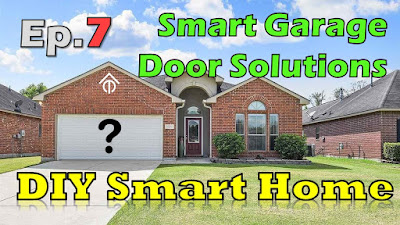
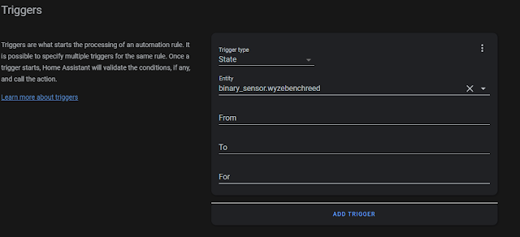
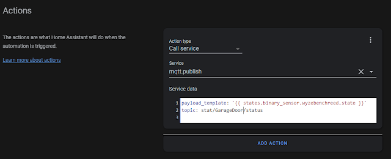

[](https://youtu.be/TZbTnpyZZeo)

  

UPDATE: The Shelly1 process shown in [this video](https://youtu.be/_oRr8FZyyQ0) is the easy no solder method.  

  

[Video](https://youtu.be/TZbTnpyZZeo)

  

We added a bit of DIY automation to the garage door for minimal costs and of course without any fees or forced cloud control  Taking a deep dive for the new folks to the DIY Garage scene and for the semi-DIY'ers we also show some other easy solutions.

  

**Parts**

[Sonoff SV](https://amzn.to/3dV1ypG)

[Sonoff SV (Direct from iTead)](http://shrsl.com/2bsw3)

[Reed Switch for Open/Close Sensor](https://amzn.to/2Uu8BxR)

[Alternate Reed Switch](https://amzn.to/2MJLNpI)

  

[Moes Garage Door Opener](https://amzn.to/3bnvubZ) (not a recommended choice unless you like this hardware)  Shelly1 or Sonoff SV is my recommendation

  

[Wyze Sensor Setup Video](https://youtu.be/19UCwf4uidQ)

[Moes Garage Door Opener Setup Post](https://www.digiblur.com/2020/05/moes-garage-door-opener-tasmota.html)

[Tasmotizer Download](https://github.com/tasmota/tasmotizer/releases)

  

**Tasmota Garage Setup & Rules (for easy copy and paste from the video)**

**ATTN Shelly1 Users! Use the Shelly1 Section at the bottom of this post for modified rules/commands (the below is for the Sonoff SV)**

_switchmode2 1_

_poweronstate 0_

_setoption0 0_

_pulsetime1 10_

(This rule below should all be pasted at one time)

_Rule1 on switch2#state=0 do publish2 stat/%topic%/status closed endon on switch2#state=1 do publish2 stat/%topic%/status open endon_

  

Turn on the rule with this command:

_Rule1 1_

  

**Sonoff SV - YAML Config**

  

cover:

  - platform: mqtt

    name: "Garage Door"

    command\_topic: "cmnd/GarageDoor/POWER"

    state\_topic: "stat/GarageDoor/status"

    availability\_topic: "tele/GarageDoor/LWT"

    qos: 1

    payload\_available: "Online"

    payload\_not\_available: "Offline"

    payload\_open: "ON"

    payload\_close: "ON"

    payload\_stop: "ON"

    state\_open: "open"

    state\_closed: "closed"

    device\_class: garage

  

Change the MQTT Topic of "GarageDoor" in all three spots if  you use a different topic in the Tasmota MQTT Config

  

**How to Utilize a Wireless Door/Window Sensor (Wyze, Zwave, Zigbee, 433mhz etc)**

  

Setup the wireless sensor in Home Assistant and verify it is working.  The switch2 rule and setup of the wired reed sensor will not be needed in Tasmota.  You will still need the pulsetime1 command done to only make the relay toggle for the short period to simulate the garage door button push.  

  

Create an automation in Home Assistant either via the YAML editor or Automation GUI as follows.  Edit the binary\_sensor and MQTT topic name as needed. This will push the state of the wireless sensor state changes into MQTT which Home Assistant will then read as an all in one sensor/relay from the Garage Door.  A small but quick loop around trick!  

  

**YAML Method**

```yaml
- id: '15912322314808'
  alias: Reed2MQTT
  description: ''
  trigger:
  - entity_id: binary_sensor.wyzebenchreed
    platform: state
  action:
  - data:
      payload_template: "{{ states('binary_sensor.wyzebenchreed') }}"
      topic: stat/GarageDoor/status
    service: mqtt.publish
```
**GUI Method**

  

[](https://1.bp.blogspot.com/-poISG39O3wg/Xyc0vBqjYLI/AAAAAAAEc-E/zk8iKsQJxW88DVZ5Q7dhfQ_D8L4THCl-ACLcBGAsYHQ/s1090/garage_gui1.png)

  

  

[](https://1.bp.blogspot.com/-uEdbIGRKThg/Xyc0ySzlgEI/AAAAAAAEc-I/GufQOVnXVY4Qr1Ug8Pi_Up-r6gRQPXMjwCLcBGAsYHQ/s1072/garage_gui2.png)

  

  

**YAML Config for secondary reed sensor (small change to state payloads)**

  

cover:

  - platform: mqtt

    name: "Garage Door"

    command\_topic: "cmnd/GarageDoor/POWER"

    state\_topic: "stat/GarageDoor/status"

    availability\_topic: "tele/GarageDoor/LWT"

    qos: 1

    payload\_available: "Online"

    payload\_not\_available: "Offline"

    payload\_open: "ON"

    payload\_close: "ON"

    payload\_stop: "ON"

    state\_open: "on"

    state\_closed: "off"

    device\_class: garage

  

  

**Shelly 1 Tasmota Garage Setup & Rules** 

_switchmode1 2_

_poweronstate 0_

_setoption0 0_

_pulsetime1 10_

(This rule below should all be pasted at one time)

_Rule1 on switch1#state=0 do publish2 stat/%topic%/status closed endon on switch1#state=1 do publish2 stat/%topic%/status open endon_

  

Turn on the rule with this command:

_Rule1 1_

  

**Shelly1 YAML Config**

  

cover:

  - platform: mqtt

    name: "Garage Door"

    command\_topic: "cmnd/GarageDoor/POWER"

    state\_topic: "stat/GarageDoor/status"

    availability\_topic: "tele/GarageDoor/LWT"

    qos: 1

    payload\_available: "Online"

    payload\_not\_available: "Offline"

    payload\_open: "ON"

    payload\_close: "ON"

    payload\_stop: "ON"

    state\_open: "open"

    state\_closed: "closed"

    device\_class: garage

  

**Can't see the little garage door being up or down in the Home Assistant GUI?  Create an easy to read binary sensor**

**Secondary Binary Sensor YAML Config**

  

binary\_sensor:

  - platform: mqtt

    name: "Garage Door State"

    state\_topic: "stat/GarageDoor/status"

    payload\_on: "open"

    payload\_off: "closed"

    availability\_topic: "tele/GarageDoor/LWT"

    payload\_available: "Online"

    payload\_not\_available: "Offline"

    qos: 1

    device\_class: opening  

  

\-=-=-=-Products We Use/Recommend-=-=-=-

Amazon US - [https://amzn.to/2YZNDeO](https://amzn.to/2YZNDeO)

Amazon UK - [https://amzn.to/2TnG2R4](https://amzn.to/2TnG2R4)

Amazon CA - [https://amzn.to/2HchPZe](https://amzn.to/2HchPZe)

  

\-=-=-=-Come chat with us!-=-=-=-

Discord - [https://discord.gg/bNtTF2v](https://discord.gg/bNtTF2v)

Patreon - [https://www.patreon.com/digiblurDIY](https://www.patreon.com/digiblurDIY)
