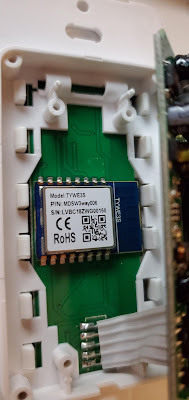

  

  

<iframe allowfullscreen height="266" src="https://www.youtube.com/embed/imKZbhJ8lvU" width="320" youtube-src-=""></iframe>

  

  

If I you have an easy to open device with the TYWE3S module or simply open via/pin headers please be sure to share it in the comments below, email digiblurDIY on the Gmail domain, or send it via Discord (link below).  I'll update this post with various pictures and setup information as things progress below.

  

Take your stuff out the cloud and make it yours!  You paid for it, don't let someone else control it or possibly steal/spy on your data.  Tuya-Convert blocking have you locked into the cloud?  Let's check out the Tuya / Smartlife Flashing Jig.  You'll definitely be doing a dance of some sort after flashing Tasmota or ESPHome to your devices containing the TYWE3S module.  

  

[Jig Pogo Pins](https://amzn.to/3h7fJcH)

[USB Flasher (FTDI)](https://amzn.to/2W8ocUL)  or [others](https://amzn.to/2OuuqKo)

[Jumper Wires](https://amzn.to/2DlghNf)

[Test Probes](https://amzn.to/2BRSR1C) or [others](https://amzn.to/2AIA2NU) 

[2 inch Clamp(optional)](https://amzn.to/3fxwGwx)

  

[Fan/Dimmer Combo mentioned](https://amzn.to/3eY2iLh) 

  

If you are looking for a jig to be printed please message me on Discord - [https://discord.gg/bNtTF2v](https://discord.gg/bNtTF2v)

  

**Resources**

How to Use/Configure Tasmota - [https://youtu.be/KOg5qwO3Rh4](https://youtu.be/KOg5qwO3Rh4)

Jig 3D Priint File - [https://www.thingiverse.com/thing:4099748](https://www.thingiverse.com/thing:4099748)

Fan Module Blog Post - [https://www.digiblur.com/2020/07/the-tasmota-fan-controller-ive-been.html](https://www.digiblur.com/2020/07/the-tasmota-fan-controller-ive-been.html)

Esptool.py install - [https://github.com/espressif/esptool](https://github.com/espressif/esptool)

Tasmotizer - [https://github.com/tasmota/tasmotizer](https://github.com/tasmota/tasmotizer)

NodeMCU-Pyflasher - [https://github.com/marcelstoer/nodemcu-pyflasher](https://github.com/marcelstoer/nodemcu-pyflasher)

Esphome - [https://esphome.io/](https://esphome.io/)

Tasmota - [https://tasmota.github.io/docs/](https://tasmota.github.io/docs/)

  

**Products We Use/Recommend**

Amazon US - [https://amzn.to/2YZNDeO](https://amzn.to/2YZNDeO)

Amazon UK - [https://amzn.to/3gVLiFZ](https://amzn.to/3gVLiFZ)

Amazon CA - [https://amzn.to/2HchPZe](https://amzn.to/2HchPZe)

  

**Come chat with us!**

Discord - [https://discord.gg/bNtTF2v](https://discord.gg/bNtTF2v)

Patreon - [https://www.patreon.com/digiblurDIY](https://www.patreon.com/digiblurDIY)

# **  

**TYWE3S or Open Pin Header Devices**

**

  

[TreatLife Fan Speed Controller](https://amzn.to/3eY2iLh) / Light Dimmer Combo - [Setup Instructions](https://www.digiblur.com/2020/07/the-tasmota-fan-controller-ive-been.html)

  

