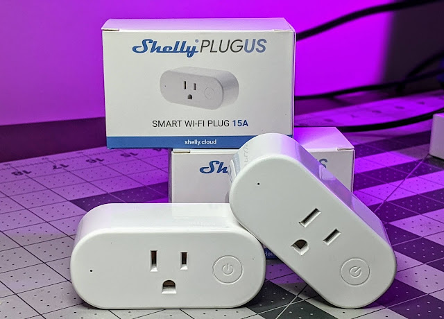
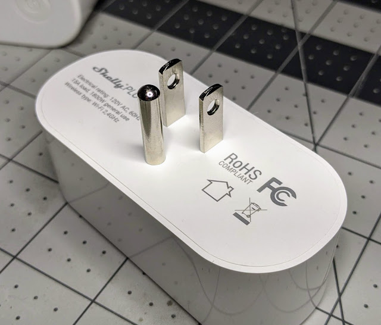
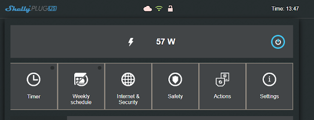
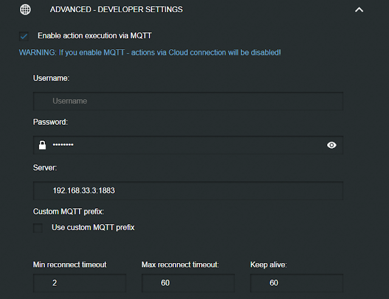
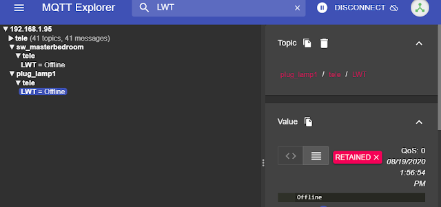
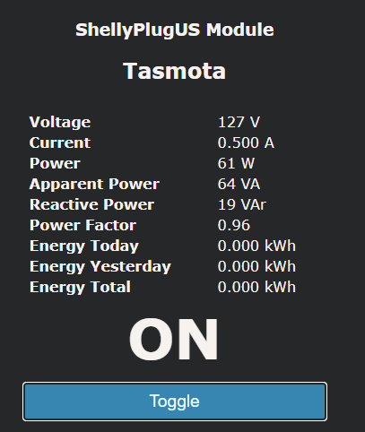
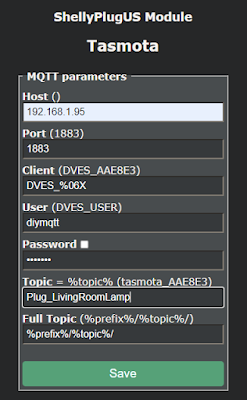
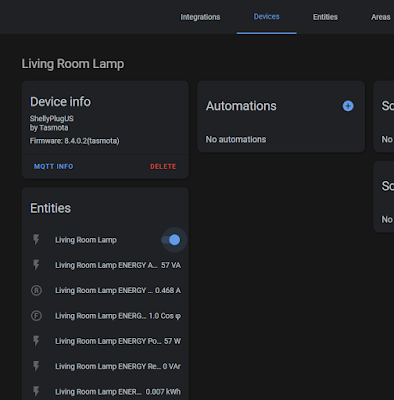

 

  

UPDATE: Full video review/setup an issue or two I found - [https://youtu.be/\_TSJB\_IzxG0](https://youtu.be/_TSJB_IzxG0)

  

If you are familiar with the Shelly devices from the Shelly1 to Shelly 2.5, etc this might be old hat for you.  They are 120VAC power, 15A smart plugs with power monitoring!  Local control options right out of the box.  No flashing, no Tuya Convert, etc. required.  If you are thinking at first glance you might have seen this plug before, you might not be wrong.  Subscribe and enable notifications for the [digiblurDIY YouTube](https://www.youtube.com/digiblurDIY) channel to catch an upcoming video on it.

  

Purchase from the [ShellyUS Store](https://bit.ly/2QlEGWx) - [2 Pack US Plugs](https://bit.ly/2YcSVRC) (use the 10% off coupon of travis10)

  

There are a few things they got right and few things they didn't get right unfortunately.  For starters the design is a plus, it doesn't block the second plug.  You can put two of these on the same outlet with ease.  Power monitoring is another huge plus!  Great for those washer and gas dryer notifications on the laundry which is still one our favorite automations to this day.  The software that comes with the [ShellyPlugUS](https://shopusa.shelly.cloud/shelly-plug-us-two-pack-wifi-smart-home-automation-1?tracking=hWYa3wkmANWQWaLcM8r4S3mpUjjqYMfS) is open and welcomes developers.  You can opt to use their cloud or if you are like me and don't care for their app much, I just add it to my network using the AP mode and enable MQTT on it.  And last but not least, you can easily upgrade this to Tasmota or ESPHome.  Yes!  I said upgrade as there are some issues with the stock firmware that I will explain shortly.  

  

So what's the bad?  Flip it over to the back....

  

  

Notice something missing? No screws and no pin header!  C'mon Shelly!  Don't forget your roots, that's why you have so many die hard fans.  You had an opportunity to knock the Sonoff S31 plug off the throne of "the" go to power monitoring plug for the DIY crows but you blew it.

  

**So about that stock firmware...**

  

  

The web interface is the same one you are used to, power monitoring was right on point.  I plugged in a 60 watt bulb and my Kill-a-watt meter also agreed it was 57 watts.  Sadly no amps, no volts, etc. but we will get to that.  

  

  

Enabled MQTT and put in our broker information.  I kept it default and didn't choose retain to see how things worked.  Unfortunately it doesn't even retain the online presence in MQTT and didn't seem to fully support LWT (Last Will and Testament).  I enabled retain and tried again.  The only thing it retained was the state of the plug and energy information.  That's definitely a problem if it doesn't properly support one of the fundamentals of MQTT.  

  

`<table align="center" cellpadding="0" cellspacing="0" style="margin-left: auto; margin-right: auto;"><tbody><tr><td style="text-align: center;"></td></tr><tr><td style="text-align: center;">MQTT info</td></tr></tbody></table>`

  

  

Take for instance a Tasmota device shown above.  It has a retained message on plug\_lamp1 as the MQTT broker dropped the Offline message after the Tasmota device fell from the network.  This allows anything else that connects to MQTT such as HomeAssistant to see that the device is offline and not allow the user to interact with it.  The stock Shelly firmware seems to be broken in this aspect.  

### Upgrade to Tasmota

So how do we fix this?!?  We upgrade it to [Tasmota](https://github.com/arendst/Tasmota) which also adds a ton of additional features!  It is simple!  All you need is your web browser.  I discussed the process in this [video](https://youtu.be/_oRr8FZyyQ0) and it is documented in this [Github](https://github.com/yaourdt/mgos-to-tasmota) with the link to use for the ShellyPlug US upgrade.

  

<iframe allowfullscreen height="266" src="https://www.youtube.com/embed/_oRr8FZyyQ0" width="320" youtube-src-=""></iframe>

  

If you followed the video or did it based off the Github link, please make sure you use the firmware upgrade menu to upgrade Tasmota via the web to the latest and greatest release.  This will enable all the features necessary such as PowerDelta and many others.  

  

Go to the Console page and paste in the following on one line and hit enter:

  

_backlog module 0 ; template {"NAME":"ShellyPlugUS","GPIO":\[52,255,57,255,21,134,0,0,131,17,132,157,0\],"FLAG":0,"BASE":45}_ 

Give it a few seconds and it will reboot and the console will refresh.  Paste the following in on one line:

  

_rule1 on power1#state do backlog ledpower1 %value%; ledpower2 %value% endon on power1#boot do backlog ledpower1 %value%; ledpower2 %value% endon_

  

Then you need to enable the rule that sets the red/blue status lights with one last command:

  

_rule1 1_

Hit the Main Menu button and you should be greeted with something like this:

  

  

  

I did notice the energy calibrations were some what close right out of the gate.  I typically use an incandescent 60w light bulb to set the 3 calibrations.  If you have Kill-a-Watt meter or other devices with known loads you can use that to tweak your calibrations.  

  

In order to easily calibrate your device with a 60 watt bulb I first check my house voltage with another plug/device or a volt meter.  Then I issue the following commands separately on console:

  

_powerset 60_

_currentset 500_

_voltageset 122_

"powerset 60" for 60 watts, currentset 500 for 0.500 amps and voltageset 122 for the 122 volts found during this test.  As I mentioned before my bulb was showing 57 watts, using a voltage/amps/watts calculator to get it exact I would use 122V, 57W, and 0.467 amps.

### Add it to Home Assistant

Go to Configuration, Configure MQTT. 

  

  

Enter in your MQTT IP, User and Password.  Change the Topic to a unique name that resembles the device.  Save it.  Go to Configuration, Configuration Other and set the Device Name and Friendlyname to something user friendly such as "Living Room Lamp".  Save it.  Return to the Tasmota Console enter in the following command:

  

_setoption19 1_

This will enable Auto Discovery and pull right into HomeAssistant **without** any YAML editing.  All you need to do is go to your HomeAssistant MQTT integration to use the device.  Enjoy!  

  

  

  

Stay tuned for my upcoming video on a few comparisons of this device... if you think you've seen this plug before you might not be wrong.  Hmmm.....

  

Purchase from the [ShellyUS Store](https://bit.ly/2QlEGWx) - [2 Pack US Plugs](https://bit.ly/2YcSVRC) (use the 10% off coupon of travis10)

  

Be sure to check us out on [YouTube](https://www.youtube.com/digiblurDIY) and [Discord](https://discord.gg/bNtTF2v) if you have any questions.  

  

**Products We Use/Recommend**

Amazon US - [https://amzn.to/2YZNDeO](https://amzn.to/2YZNDeO)

Amazon UK - [https://amzn.to/3gVLiFZ](https://amzn.to/3gVLiFZ)

Amazon CA - [https://amzn.to/2HchPZe](https://amzn.to/2HchPZe)

  

Discord Chat - [https://discord.gg/bNtTF2v](https://discord.gg/bNtTF2v) 

Patreon -  [https://www.patreon.com/digiblurDIY](https://www.patreon.com/digiblurDIY)

  

Links to products provided by the ShellyUS Store and Amazon Affiliate program.
