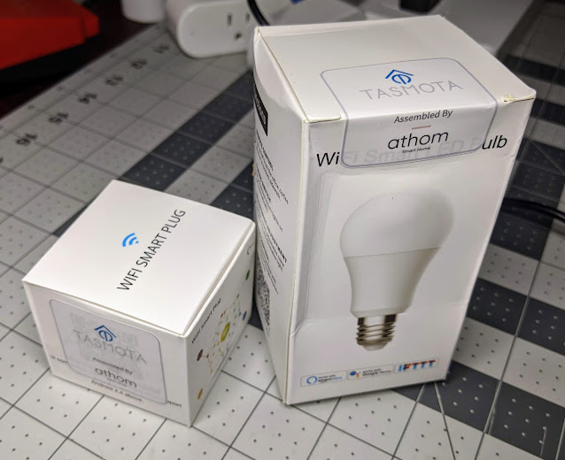
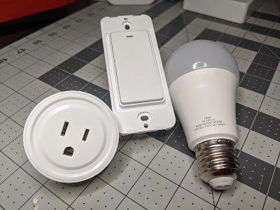

  

(Don't forget the 30% coupon code towards the end of this post!)

UPDATE 2020/11/01 - Notice posted on their website:

**_Notice:_**

**_The product purchased ealier than 20th Oct are 2m bin which is not compaitble wih official Tasmota OTA server. After 20th Oct 2020, the product changed to standard 1m bin and fully compatible with official Tasmota OTA server_**

You heard correctly.  No flashing, no jumper wires, no soldering, no Tuya Convert, etc., take the smart bulb, switch, plug, etc., out of the box, plug it in and it is ready to go!  The device will be in access point mode ready to add to your Wi-Fi network.  ESPHome users can easily apply their own configuration to use them as well!  

But why do we need this?  Can't we just flash our own devices?  Absolutely! If you have the skills and know how to flash the all of your devices then this might not be for you.  

Do you just want something ready to go?  Keep reading, more and more smart home devices such as Smart Bulbs and Smart Plugs are almost impossible to flash via soldering/jig methods due to the pins not being accessible.  Then let's not forget, many smart devices have moved to RTL based chipsets that can't be flashed with Tasmota/ESPHome at all.

A company name ATHOM Technology is bringing several devices to the table to help break down the barriers of having a true smart home that isn't dependent on the cloud and possibly some company selling your data.  It reminds me of the exciting times where we could first start buying computers with Linux installed and didn't have to pay for the Windows license!

  

I've looked at several of the products in this run and while one glaring issue I have upfront is the lack of open pin headers like you might see on a Shelly1 switch, you do have to keep in mind that things will only get better as hardware runs continue to improve and we voice our opinions with the company.  With that said, I was pleasantly surprised with the RGB+CCT (5 channel color) smart bulb brightness.

I do plan on doing a full review video of several of them but I have been delayed in my schedule with the current Hurricane Laura recovery efforts.  Instead of wasting more time for the ones that want to check this out right now, I'm doing this blog post to share a coupon code for 30% off on their store at [https://athom.aliexpress.com/](https://athom.aliexpress.com/store/5790427?d=y&aff_platform=portals-tool&initiative_id=SB_20200910185835&sk=_Bfi6BWCL&aff_trace_key=6bf960f14e0243c1bed5a0c00051d986-1599793268788-01279-_Bfi6BWCL)  just put in DIGIBLURDIY as the promo code.  UPDATE:  There are only 100 coupons available, once I get confirmation they are done, I'll edit this post.   

Stay tuned to the digiblurDIY YouTube channel.... [https://www.youtube.com/digiblurDIY](https://www.youtube.com/digiblurDIY)

Upgrade procedures to the latest Tasmota (if you have a 2M or 4M flash-thanks @BigChief) . Go to the console and issue

_reset 5_

_template 255_

Copy this template to a temporary location then issue this command:

_Module 19_

Go ahead and upload the latest tasmota.gz file or tasmota-lite.gz file via the firmware upgrade button in the GUI. Do not use minimal. This is always the last resort file to use and isn't needed here. 

Once it is upgraded go back to the console and issue

_Reset 5_

Apply your template again from above.
