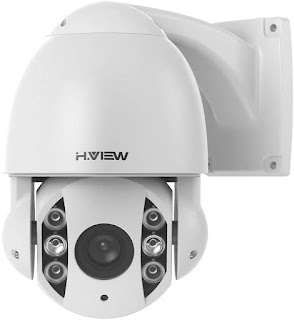
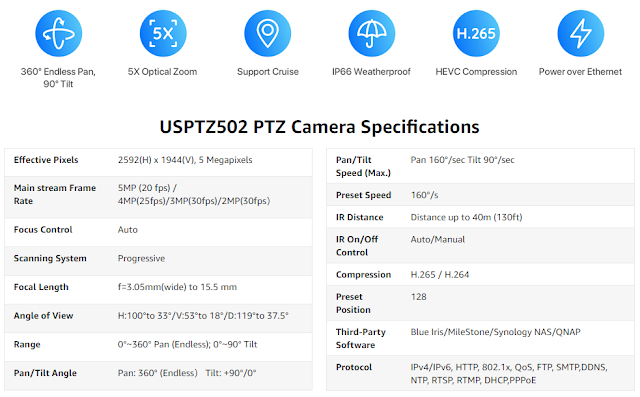
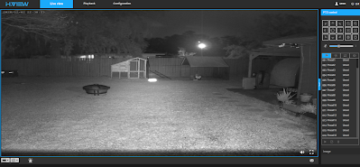
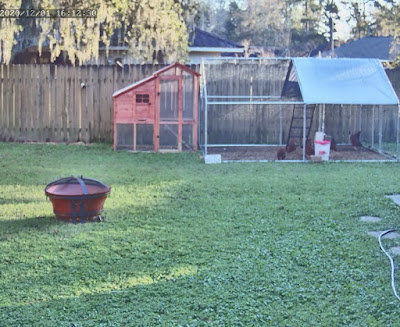

  

I had the pleasure (or not) of testing out another PTZ camera.  I'm always down on checking out a new one after the last three I checked out, such as the [Amcrest](https://youtu.be/h7zYJ9V8n6Q), [Reolink](https://youtu.be/YGKoiabqESc) and I'll not mention the last one that didn't fair to well in a [video](https://youtu.be/NnTaK5XJRgU).  PTZ cameras are addicting and useful to complement your fixed position cameras, **once you go PTZ you can't go back!** 

The [H.View PTZ 502](https://amzn.to/37rK02F) is a 5MP camera with 5x optical zoom and is POE capable, even at non POE+ specs it works!  Other PTZs we've had to use POE+ for additional power.  Speaking of that at first glance I noticed something....

  

I had seen this camera before!  Well at least the shell of the camera.  The lens part was a little different but it was almost the same housing.  The Reolink is only 4x though instead of the H.View being 5x.  The one drawback I had with the Reolink was the speed of moving and focus took too long, especially after we got spoiled with the Amcrest PTZ camera. 

  

  

  

After opening the box I decided to check out the non POE+ claim to see if it would power up.  Sure enough it did!  But what did they give up to have lower power requirements?  Let's find out!  I looked on my router's camera VLAN for a new device IP address.  Hmm...There wasn't one?  Maybe the POE+ is required, so I tested it on a POE+ switch.  Still no IP!  That's strange, usually if I plug in other cameras they just pull an IP address via DHCP and you can browse to the web GUI.  So I looked on the label and sure enough it had the issue, out of the box it is setup for 192.168.1.20 as a static IP.  WOW!  Failure #1.  Don't assume everyone has a network range like that along with that IP being open. Luckily I had an old router I was able to fire up and attach this camera to it, browse to the static IP, change it to DHCP then plug it back into my network.  Alrighty, off and running now!

  

Browse to the IP and no video screen feed comes up.  After a bit of digging it seems to require Adobe Flash that of course is being discontinued this month (Dec 2020).  I emailed the manufacturer after not seeing a firmware update on their [website](https://hviewsmart.com/).  They immediately sent a new firmware BIN file to upload to the camera.  I do find it very strange for a camera manufacturer to host their firmware updates on a Google Drive instead of their website.  Seem sketchy to you?  

  

So after all these hoops to jump through we were finally off and running!  

  

  

Of course like a kid in a candy store I wanted to check out the PTZ controls.  I did find the web GUI to have a bit of delay which was making it hard to control, much like doing a remote screen share via satellite internet.  It was a little better if I opened up an RTSP stream to see it but I still found it to be somewhat slow compared to other cameras.  A quick check of the specs and sure enough, 160 degrees/sec compared to the what I thought was slower, the Reolink has a spec of 180 degress/sec.  That must be the difference in not requiring POE+ power with this camera.

  

I was able to pull it right into Blue Iris without any issue, control all the PTZ directions, pull in both main and sub streams as well.  Check mark there for the camera!

  

As you can tell I've had issue after issue with this camera, b**ut wait there's more!**  After a power outage the camera ends up pointing downward and backwards. What? Maybe there's a return to position setting that isn't set?  I couldn't find one in the web GUI to make it return to the last position.  Another issue I found was I would check back on the camera at various times of the day and find it not focused.   It would be all blurry and I'd have to focus it manually.  I'm not sure what was causing this issue.  If I zoomed it all the way in it seemed to fix the focus for a while though.  

  

So would I buy or recommend this camera?  Nope, currently as of 12/2/2020 it's priced at $280 USD with 10% off ($252..prices subject to change).  It's more expensive, slower, no SD card option and various other issues.  I definitely pick up the Reolink RLC-423 for less or for a $30-$40 more I'd just jump for a Amcrest PTZ and get 12x zoom and more speed.  

  

Once the issues with the firmware, focusing, speed, etc get resolved possibly we could do some video review footage of the camera, until now here are a few clips.  It isn't hammer time just yet! :)

  

Snapshot using the snap feature of the GUI

  

  

Snapshots pulled via the RTSP main stream feed (some might be out of focus due to the auto focus issue)

  

  

  

  

  

  

\-=-=-=-Connect!-=-=-=-

Discord Chat - [https://discord.gg/bNtTF2v](https://discord.gg/bNtTF2v)

Patreon - [https://www.patreon.com/digiblurDIY](https://www.patreon.com/digiblurDIY)

DISCLAIMER: I am a participant in the Amazon Services LLC Associates Program, an affiliate advertising program designed to provide a means for me to earn commissions by linking to Amazon.com and affiliated sites.  Most or all product links are affiliate links and digiblurDIY will receive compensation if used.
