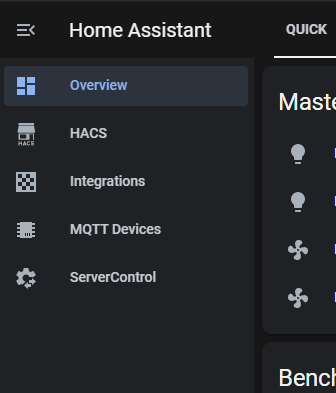

Are you just as tired as I was digging for stuff you go to all the time in Home Assistant?  I know I was!  The developers always seemed to move stuff on me too.  I wanted my Server Control, Integrations, and MQTT devices right at my finger tips instead of buried in menus and large integration panels lists.  I seem to get asked this question on every live stream which is a good thing!  So here's how to do it, it's simple.  

Open your configuration.yaml file in whatever method you like to edit files, VSC, Notepad++, vi, etc. Make sure you do not have a "panel\_custom:" section already.  If not, just copy and paste this one in.  

panel\_custom:

  - name: ha\_server\_con

    sidebar\_title: ServerControl

    sidebar\_icon: mdi:cog-transfer

    js\_url: /api/hassio/app/entrypoint.js

    url\_path: 'config/server\_control'

    embed\_iframe: true

    require\_admin: true

    config:

      ingress: core\_configurator  

  - name: ha\_mqtt\_dev

    sidebar\_title: MQTT Devices

    sidebar\_icon: mdi:chip

    js\_url: /api/hassio/app/entrypoint.js

    url\_path: 'config/devices/dashboard?historyBack=1&config\_entry=abcdefgh123456xxxxxxx'

    embed\_iframe: true

    require\_admin: true

    config:

      ingress: core\_configurator        

  - name: ha\_integ

    sidebar\_title: Integrations

    sidebar\_icon: mdi:checkerboard

    js\_url: /api/hassio/app/entrypoint.js

    url\_path: 'config/integrations'

    embed\_iframe: true

    require\_admin: true

    config:

      ingress: core\_configurator  

"But I run Core and not Hassio/OS!"  Don't worry.  I run Core as well and this still works.  One thing everyone will need to change is the config\_entry code as seems to be unique per install.  Open your Integrations and right click on the MQTT Devices and copy the URL.  The URL will have your unique config\_entry code.  Replace it over the one above, only paste in the config\_entry code, not the entire URL!  Save your configuration yaml file.

For one last time, dig around for Server Control, do the Check Configuration.  If everything passes, hit restart.  Once Home Assistant restarts you'll have the new panels.  Don't forget, you can long left mouse click on the "Home Assistant" title to change the order and hide each panel as needed.  

What other panels have you added?  Please share them! 

🔥📞Connect!☎️🔥

Discord Chat - [https://discord.gg/bNtTF2v](https://discord.gg/bNtTF2v)

Patreon - [https://www.patreon.com/digiblurDIY  
](https://www.patreon.com/digiblurDIY)Instagram - [https://www.instagram.com/digiblurDIY](https://www.instagram.com/digiblurDIY)

🔥⚡Products We Use/Recommend⚡🔥  
Amazon US - [https://amzn.to/2YZNDeO  
](https://amzn.to/2YZNDeO)Amazon UK - [https://amzn.to/2TnG2R4  
](https://amzn.to/2TnG2R4)Amazon CA - [https://amzn.to/2JWsNq5](https://amzn.to/2JWsNq5)

DISCLAIMER: I am a participant in the Amazon Services LLC Associates Program, an affiliate advertising program designed to provide a means for this channel to earn commissions by linking to Amazon.com and affiliated sites. Most or all product links are affiliate links and digiblurDIY could receive compensation if used.
