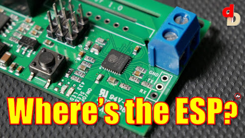

  

A little different style video talking about the future of the ESP8266 in the local control Smart Home IoT World.  Video - [https://youtu.be/hskofG2eiGs](https://youtu.be/hskofG2eiGs)  
  

  

Transplanting an ESP Module - [https://www.digiblur.com/2020/12/treatlife-dual-indoor-dimmable-smart.html](https://www.digiblur.com/2020/12/treatlife-dual-indoor-dimmable-smart.html)  
RTL Arduino SDK - [https://www.amebaiot.com/en/ameba-arduino-getting-started-rtl8710/  
](https://www.amebaiot.com/en/ameba-arduino-getting-started-rtl8710/)  

⚡Other Resources

How to Flash with the Jig - [https://youtu.be/imKZbhJ8lvU](https://youtu.be/imKZbhJ8lvU)  
  

⚡Products We Use/Recommend  
Amazon US - [https://amzn.to/2YZNDeO](https://amzn.to/2YZNDeO)  
Amazon UK - [https://amzn.to/2TnG2R4](https://amzn.to/2TnG2R4)  
Amazon CA - [https://amzn.to/2JWsNq5](https://amzn.to/2JWsNq5)  
  

⚡Connect!⚡  
Discord Chat - [https://discord.gg/bNtTF2v](https://discord.gg/bNtTF2v)  
Patreon - [https://www.patreon.com/digiblurDIY](https://www.patreon.com/digiblurDIY)  
Instagram - [https://www.instagram.com/digiblurdiy](https://www.instagram.com/digiblurdiy)  
  

DISCLAIMER: I am a participant in the Amazon Services LLC Associates Program, an affiliate advertising program designed to provide a means for this channel to earn commissions by linking to Amazon.com and affiliated sites.  Most or all product links are affiliate links and digiblurDIY could receive compensation if used.
