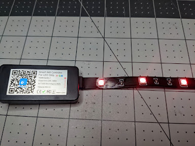
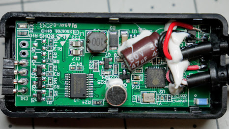
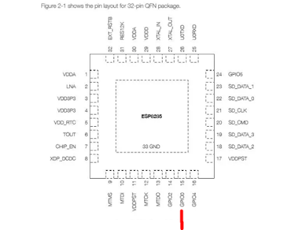
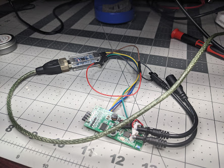
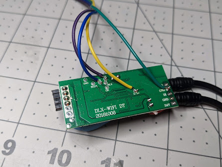
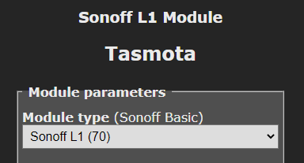
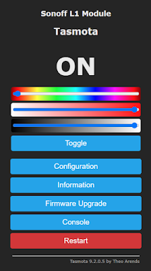
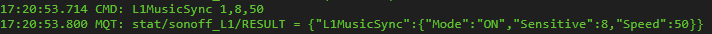

  

<iframe allowfullscreen height="466" src="https://www.youtube.com/embed/B_0bg2m6UGc" width="560" youtube-src-=""></iframe>

**[Purchase the Sonoff L1 Lite](https://shrsl.com/2swnb)**

Usually most of the LED strips I've run into that do some sort of music sync have a chipset that isn't DIY friendly.  That quickly changes with the Sonoff L1 Lite LED Strip.  A few quick specs:

- 12 VDC
- RGB LEDs (no dedicated white channel)
- Length 5M (not waterproof)
- 30 LEDs/m
- And best of all ESP8285 Wi-Fi chipset

<!--truncate-->

To flash Tasmota on the controller it is pretty straight forward except for one small issue.  Typically you need 3V3, Ground, RX, TX and GPIO Zero to flash an ESP chipset.  They did break out every thing on some nice pads for us on the back except for one small piece, the GPIO zero pad.  

  

Solder up your 4 connections on the back to 3V3, GND, RX and TX.  These will attach to your USB TTL adapter like normal, you'll need to reverse RX and TX of course, RX to TX and TX to RX.  Attach a small wire to Ground as we will need to manually hold this wire to a the Gpio0 pin on the ESP8285 while power is applied.  Be careful to not ground out anything that isn't necessary.  A few seconds after the ESP chip boots you can stop grounding this GPIO 0 pad.  

  

  

  

GPIO Zero is the 2nd from the right at the bottom(red line).  It will be close to that capacitor there but with a careful hand can be done.  

  

  

  

  

Flash Tasmota to the LED controller using Tasmotizer, esptool.py, etc and use 9.2.0.5 or higher.  You do not need to use any template, go to Configuration, Configure Module and choose the Sonoff L1 and hit save.

  

  

  

  

  

Make sure to unroll the LEDs!  Do not run them at full brightness with them rolled up.  They will overheat.  If you don't want to use the Music/Sound Sync feature then go ahead and integrate it with your favorite home automation software.

  

But wait there's more!  The microphone on the device can listen to music and other sounds.  To enable this go to the Tasmota GUI, Click Console.  

  

  

Type L1MusicSync 1,8,50 

  

Then press Enter for this test.  The L1MusicSync command structure is as follows:

  

  // L1MusicSync on/off/toggle, sensitivity, speed

  // sensitivity 1..10, speed 1..100

  

I did find this disables the IR remote control so be sure to turn it off if you have this issue when you do not want the sync to music feature anymore.

  

Happy Flashing Everyone!  

  

**[Purchase the Sonoff L1 Lite](https://shrsl.com/2swnb)**

  

Please note that links above may be affiliate link, using them could earn digiblurDIY a small commission of most purchases and helps with future video projects. Thank you!
