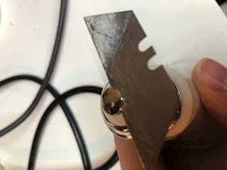
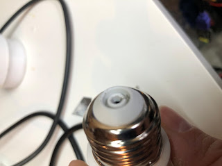
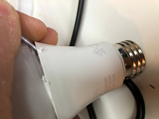
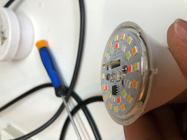
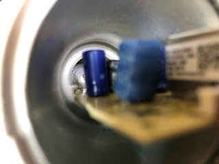
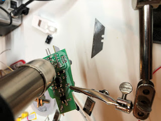
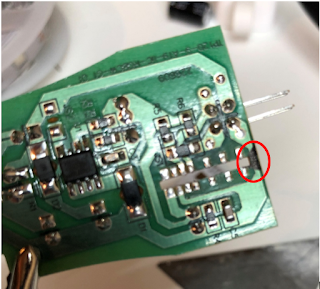
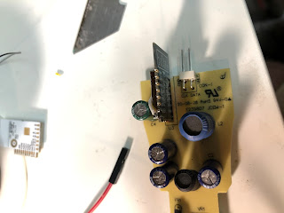
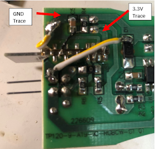

**Treatlife SL10 RGB CCW Transplant**

**By boilerboy165**

The SL10 comes with a WB8P chip inside which cannot be flashed with Tasmota or ESPHome. In this guide, I will go over the steps on how to replace the MCU with an ESP8266 esp12 board. My bulb uses an SM2135E chip to control the colors on the bulb. Thankfully Tasmota can control the SM2135E.

**Tools Needed:**

- · Soldering iron & solder
- · Wire cutters
- · Small side cutters
- · 2 smaller flat blade screwdrivers or spudgers
- · Razor blade
- · Esp8266 12E
- · 30 AWG and some larger 20-24 AWG wire

**Teardown:**

Let’s walk through the dismantling of the bulb. There are a few other guides out there but this is what worked best for me. Disclaimer – I am not responsible for any injury, damage, emotional, or physical harm if you follow this guide. This is dealing with high voltage. Do not power the bulb if it is open. You are doing this at your own risk.

Start with removing the line power metal pin on the bottom of the bulb. A sharp blade works best in this application. I used the sharp blade (CAREFULLY) to pry the metal up. Once it has slightly separated I use a screwdriver to pull it the remainder of the way.

  

There is a small wire underneath, take the small screwdriver and unhook the wire.

  

Next we will remove the top globe. Put the small flathead into the between the frosted globe and the main body. Use this screwdriver as a wedge to create enough room for a larger flathead screwdriver. Work this screwdriver around the globe to separate the glue from the globe. Pop the globe off.

  

Pry the LED board up taking care to not bed the pins. Use a screwdriver or blade to remove the glue if you cannot pry the board up easily.

  

There is a white wire that is connecting the circuit board to neutral on the crimped based. This wire is hooked in but can be dislodged by pressing it down with a dull long object (cue the flathead screwdriver).

  

Once the wire is dislodged, pull the board up. Ensure that the line wire isn’t hooked at the base.

Once you get the board out, you can then remove the MCU. A heat gun works best for this but isn’t required. If you haven’t bought one yet, now is a great time as you can get one off Amazon for less than $50. Turn the air speed down to the lowest and the heat setting to the max setting. Slowly wave the air wand over the solder to evenly heat the entire MCU. Test to see if the MCU’s solder is molten by pressing on it with a screwdriver. DO NOT TOUCH! The MCU and board will be hot. If the MCU doesn’t fall out, keep applying heat evenly over all the pins. Try again until it falls off.

  

Congratulations! Your board no longer has a non-tasmotizable MCU.

**Replacement of the MCU**

 Flash the ESP8266 before you put it in the bulb. This is the easiest method to get the ESP ready. I purchased a ESP jig to easily flash the boards.

  

To make installing the esp easier and for the antenna to protrude out of the LED board, you have to cut the board. Unfortunately this cuts the ground plane to the LED board so we will need to re-route the ground line. Cut the board with the side cutters. I marked my board where to cut.

Create a small jumper wire to bridge GND and GPIO 15. I use a small wire to insert into both holes. Solder this jumper.

  

The board should be placed VCC side towards the board. VCC, GPIO12 and 13 will be soldered to the traces. Thankfully, these pins line up almost perfectly with the current traces on the board. Solder these pads. The EN pin can also be soldered but it will need a jumper to VCC. I used a 30 awg wire to jumper the connection.

You will need to bring a ground wire around from GND to the ground bus. Take care to keep the wire as close to the board as possible since the LED board will be touching it. Solder the wire to the GND pin on the ESP and to the ground bus on the other side of the board. Solder the jumper wire for the ground line to the ground plane to bridge the part we cut earlier.

  

  

Verify you don’t have any solder bridges, ensure your connections are solid and if everything looks good, and it is time to put everything back together. Bend the white wire where it is stripped 90 degrees to the board. This will allow for it to come into contact with the metal housing. Slide the board into the slots taking care to not bend the main power wire.

Put the main LED board onto the board’s pins. Take care that the ESP guides through the LED board’s cutout.

Hook the power wire over the ridge at the bottom of the bulb and snap the metal pin back in. Ensure the power wire doesn’t unhook. Snap the clear cover back onto the light. The light is now ready for power.

**The software:**

Power the bulb up. If you don’t see any magic smoke, you are in the clear. If the tasmota AP shows up, the fruits of your labor has come to fruition. Add the bulb to your network – follow all the other usual steps.

V9.2 Template - {"NAME":"SL10","GPIO":\[1,1,1,1,1,1,1,1,4064,4032,1,1,1,1\],"FLAG":0,"BASE":18}

Once the template is active, you should be able to control the light. Unfortunately the colors won’t be correct. Fortunately, the creators of Tasmota have us covered. There is a set option to be able to re-map our colors.

Type “So37 30”

The bulb will reboot.

Enjoy the new bulb!

**By boilerboy165**

Need additional assistance?  Join us in Discord - [https://discord.digiblur.com](https://discord.digiblur.com/)
