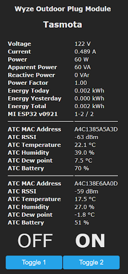

Just leaving this here...  pretty slick for an outdoor plug at this price point.  It looks like they are currently out of stock though.  I'll be doing more with this soon!  

<!--truncate-->

[Order on Amazon.com](https://amzn.to/30oyEsW)

[Notify when in Stock from Wyze.com](https://wyze.com/wyze-plug-outdoor.html)  (no affiliation)

UPDATE:  Full flashing article - [https://www.digiblur.com/2021/03/how-to-flash-wyze-outdoor-plug-esphome.html](https://www.digiblur.com/2021/03/how-to-flash-wyze-outdoor-plug-esphome.html)

Tasmota 9.5 now supports the buttons on this device - 

_{"NAME":"Wyze Outdoor Plug","GPIO":\[0,0,0,0,0,576,0,0,0,0,0,224,321,7712,7713,320,0,0,0,0,0,2624,2656,2720,0,0,0,0,225,0,4704,0,0,0,0,0\],"FLAG":0,"BASE":1}_

⚡Products We Use/Recommend

Amazon US - [https://amzn.to/2YZNDeO](https://amzn.to/2YZNDeO)  
Amazon UK - [https://amzn.to/2TnG2R4](https://amzn.to/2TnG2R4)  
Amazon CA - [https://amzn.to/2JWsNq5](https://amzn.to/2JWsNq5)  
  

⚡Be Social!⚡  
Discord Chat - [https://discord.gg/bNtTF2v](https://discord.gg/bNtTF2v)  
Patreon - [https://www.patreon.com/digiblurDIY](https://www.patreon.com/digiblurDIY)  
Facebook - [https://www.facebook.com/groups/digiblurdiy](https://www.facebook.com/groups/digiblurdiy)  
Instagram - [https://www.instagram.com/digiblurdiy](https://www.instagram.com/digiblurdiy)  
Please note that links above may be an affiliate link, utilization could earn digiblurDIY a small commission of most purchases and helps with future video projects. Thank you!
