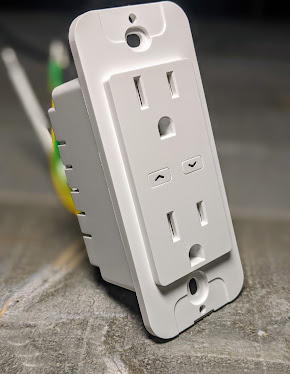
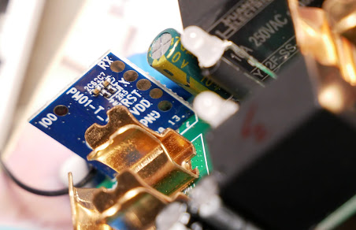
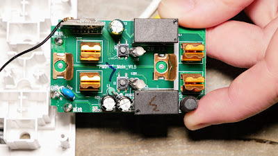
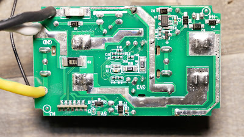
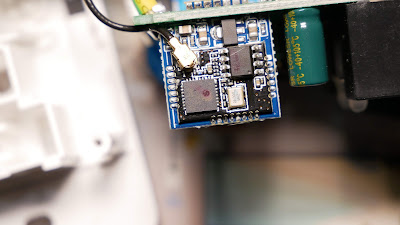
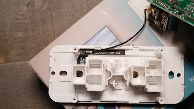
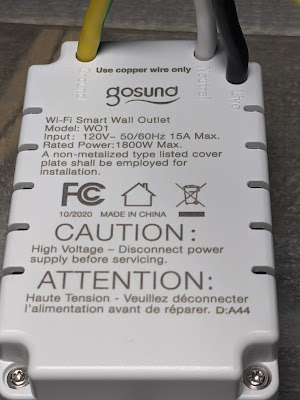

  

[Purchase the Outlet on Amazon](https://amzn.to/3eWTKHi)   (UPDATE: Rebranded link that works [https://amzn.to/3HsScAo](https://amzn.to/3HsScAo) )

Especially in 2021 there really aren't many devices that you can flash over the air with [Tuya Convert](https://youtu.be/dt5-iZc4_qU).  The Gosund Smart Outlet is one of them. Features:

<!--truncate-->

- Dual Outlets
- Dual Buttons
- Dual Relays
- Dual Relay Status LEDs
- Single channel dual Link LEDs
- ESP8285 for Tasmota!
- Power monitoring (both outlets combined into a **single** channel)

(take note [iTead Sonoff](https://amzn.to/3cNRyPU)!)  

Even if you decided to flash it OTA, having that backup option for recovery is an awesome thing since the pads are pretty easy to get to with a Torx bit (no glue or breaking anything!)  

One oddity with this outlet are the buttons.  Instead of using the available GPIO pins on the ESP chip they tied them to the analog input on the ESP and the buttons pull down the A0 pin with two different resistor values.  No, pushing both doesn't combine them, it just follows the least path of resistance of course.  Don't just snag the template below and run, you need the Rule to control them!  

After you flash your device and configure it to your WiFi go to the console and issue the following commands:

_template {"NAME":"Gosound Outlet","GPIO":\[320,0,576,0,2656,2720,0,0,2624,321,225,224,0,4704\],"FLAG":0,"BASE":18}_

_rule1 on analog#a0<400 do power2 toggle break on analog#a0<800 do power1 toggle break endon_

_rule1 1_

_module 0_

Give Tasmota a few seconds as the device will reboot to activate the template.  Go to the Tasmota main menu and you should see something similar to the following:

  

Don't forget to setup your MQTT.  I usually use an incandescent 60w light bulb to do my power monitoring calibrations, this one was pretty close and I just had to set the voltage using the "voltageset" command.  More details on power monitoring calibrations here in this video starting at the [16:55 mark](https://youtu.be/Tjg4tioZzbs?t=1015).

  

Enjoy! 

  

[Purchase the Outlet on Amazon](https://amzn.to/3eWTKHi)

  

  

  

  

  

  

⚡Products We Use/Recommend

Amazon US - [https://amzn.to/2YZNDeO](https://amzn.to/2YZNDeO)  
Amazon UK - [https://amzn.to/2TnG2R4](https://amzn.to/2TnG2R4)  
Amazon CA - [https://amzn.to/2JWsNq5](https://amzn.to/2JWsNq5)  
  

⚡Be Social!⚡  
Discord Chat - [https://discord.gg/bNtTF2v](https://discord.gg/bNtTF2v)  
Patreon - [https://www.patreon.com/digiblurDIY](https://www.patreon.com/digiblurDIY)  
Facebook - [https://www.facebook.com/groups/digiblurdiy](https://www.facebook.com/groups/digiblurdiy)  
Instagram - [https://www.instagram.com/digiblurdiy](https://www.instagram.com/digiblurdiy)  
Please note that links above may be an affiliate link, utilization could earn digiblurDIY a small commission of most purchases and helps with future video projects. Thank you!
