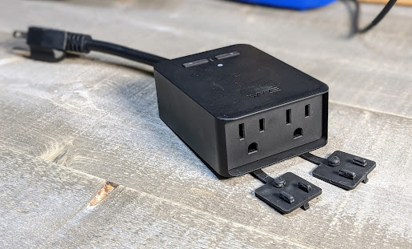
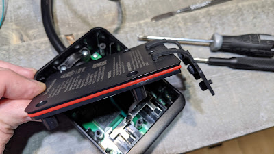
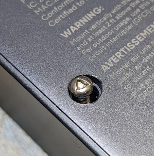
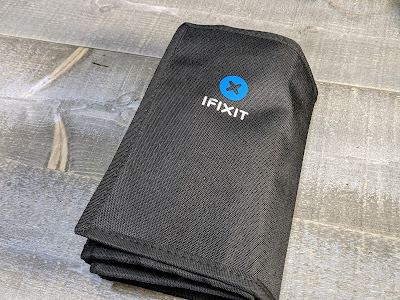
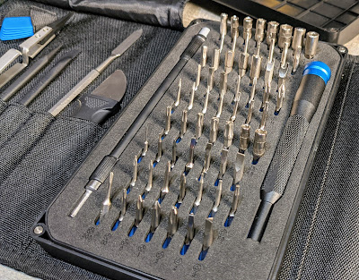
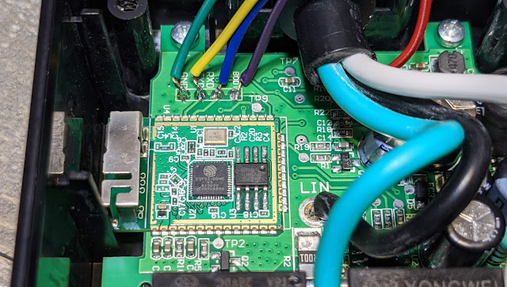
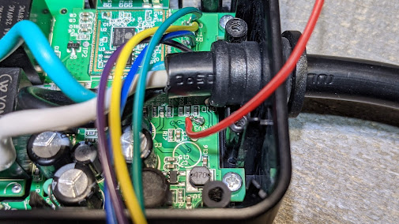
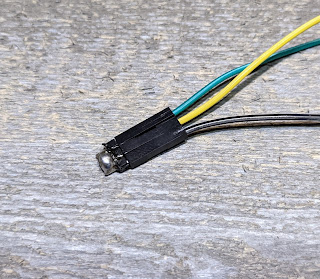

[](https://1.bp.blogspot.com/-_e9LVMQtZ2c/YF6ybOdd3pI/AAAAAAAEpks/KUbwwKaj7Hgx2Ecc2KXDioz1dYQYxTEzQCLcBGAsYHQ/s3516/PXL_20210327_032725948.PORTRAIT.jpg)

  

**Features**

- ESP32 for Bluetooth scanning!
- Higher Gain antenna than a normal ESP module PCB antenna
- LUX Sensor
- Power Monitoring (Both relays combined, single channel)
- Dual Relays
- Dual Status LEDs
- IP64 Weather proofing
- 15 Amp capacity

[Purchase the Wyze Outdoor Plug (Amazon)](https://amzn.to/3ffJTg4)

<!--truncate-->
  

First...plot change!  ESPHome is what we are going to use here.  Tasmota could be used but the two buttons would not work since Tasmota does not support the use of enabling pull-down resistors on the ESP32 module. UPDATE: 9.5 Tasmota supports this (template near the end of this article)  Yes, you heard this right, it's an ESP32 just like how the Sonoff Dual R3 came.  Luckily the efuses are not burned and we can use the device how we want, cloudless!  Thanks Wyze!  Dear Wyze, this is a good thing, you'll sell more of these plugs as well as additional word of mouth exposure for the company.  Win win situation, don't screw it up!

If you just came for the ESPHome Yaw Mill and don't care about reading or looking at my cool pics, you know the drill, go like and share my stuff, you'll find the [YAML here](https://github.com/digiblur/digiNRG_ESPHome/blob/master/WyzeOutdoorPlug/wyzeoutdoor.yaml).  

You will need to solder this plug, there's almost no way around that but it is relatively easy.  If you need to brush up on how to solder to the pads below, check out my in depth how to solder jumper wires to PCB pads in the [Sonoff Dual R3 video](https://youtu.be/VT6bY-iSveI) as well as products I used in the video description - [Sonoff Dual R3 Video.](https://youtu.be/VT6bY-iSveI)

[](https://1.bp.blogspot.com/-fqcoRKAxHWc/YF60dqcbheI/AAAAAAAEplI/ajuseeOEDjcAmp1zdDIxezXJgJewOPesgCLcBGAsYHQ/s4032/PXL_20210327_032239810.jpg)

  

[](https://1.bp.blogspot.com/-eYyPF_4MfQE/YF60dgtXWaI/AAAAAAAEplM/gtjIsLYhKFUIzVaROjqAqR8gHXemsHNiQCLcBGAsYHQ/s1969/PXL_20210327_032331989.jpg)

Wyze made a nice little weatherproof door for us to easily open and close this plug!  To access it you will need a triangle screw driver bit.  If you do not have one, it's time to get a nice kit.  You can cheap out of course and get a [cheap kit](https://amzn.to/3suihr8), but if you want a nice one, I can't say how impressed I am with the quality on the [iFixit toolkit](https://amzn.to/3fhaQQz) (they didn't sponsor this).  Super nice!  [Amazon Link](https://amzn.to/3fhaQQz)

  

[](https://1.bp.blogspot.com/-zMxOQyRnbTk/YF60wZZOd2I/AAAAAAAEplY/EXwNutBcyA00pl4PZe4TwOpO3ukICDyigCLcBGAsYHQ/s2759/PXL_20210327_032909607.jpg)

  

[](https://1.bp.blogspot.com/-_eAMEuo2rmo/YF604xml4LI/AAAAAAAEplg/CeLNUBGsLAk11SChDScq5dYnDB7I_OsSgCLcBGAsYHQ/s2898/PXL_20210327_032832373.jpg)

  

Once you get the five screws out you'll be greeted with the ESP32 module (that I traced out for you...) and the nicely labeled flashing pads.  

  

[](https://1.bp.blogspot.com/-IFJ17N_rbFA/YF61Y6jxrUI/AAAAAAAEpl0/HNvn-8htTpMoo1qc3tZkfj4SP1pSpoKhACLcBGAsYHQ/s3320/PXL_20210327_031410013.jpg)

  

Right next to the module is GND, RX, TX and BOOT.  Boot is your GPIO 0 pin that needs to be held to ground to enable the flash mode.  Where's 3.3v?  It's tucked up under the mains AC lines.  

[](https://1.bp.blogspot.com/-MehvZsfDCUk/YF62IjcNHbI/AAAAAAAEpmE/JMDFZMZqEI41QuFM6140UCgQoAkHHwz0QCLcBGAsYHQ/s4032/PXL_20210327_031535194.jpg)

If you are afraid you might melt the case or the wires soldering 3v3, you can remove the board from the case, remove the two screws on the wire clamp and rotate the board out.  **Please do not attempt to power this via Mains AC while you have small wires attached to it or the case open!**

If you only have one Ground pin on your [USB TTL](https://amzn.to/3tVUelq) adapter for flashing, I use a simple solder bridged header pin to make a splitter.  **Make sure your USB TTL is on 3v3 and NOT 5v!**

[](https://1.bp.blogspot.com/-Aky2_4UnRmA/YF63uRlE3HI/AAAAAAAEpmU/bUrezoa08dk3QCmzWBRBxHfYF14snbgYQCLcBGAsYHQ/s2022/PXL_20210327_031908806.jpg)

  

Use the provided [ESPHome YAML](https://github.com/digiblur/digiNRG_ESPHome/blob/master/WyzeOutdoorPlug/wyzeoutdoor.yaml) for an example setup, create your bin and flash it up!  Enjoy.  Flashing instructions - [https://esphome.io/guides/faq.html#i-can-t-get-flashing-over-usb-to-work](https://esphome.io/guides/faq.html#i-can-t-get-flashing-over-usb-to-work)

New to ESPHome?  Check out some of my previous sensor builds for complete walkthroughs with ESPHome setup and flashing - [Bathroom Sensor](https://youtu.be/mfaC1HZfdUY) or [Multisensor](https://youtu.be/9Yu57vjz7AY)

If you need help flashing, setting up ESPHome, or anything, feel free to join us in the Discord Chat.  [https://discord.digiblur.com](https://discord.digiblur.com/)

[Purchase the Wyze Outdoor Plug (Amazon)](https://amzn.to/3ffJTg4)

Tasmota ESP32 Bin File Template (**DO NOT USE ESPHOME FLASHER**) use the Chrome based [Tasmota Flasher](https://tasmota.github.io/install/)

```
{"NAME":"Wyze Outdoor Plug","GPIO":[0,0,0,0,0,576,0,0,0,0,0,224,321,7712,7713,320,0,0,0,0,0,2624,2656,2720,0,0,0,0,225,0,4704,0,0,0,0,0],"FLAG":0,"BASE":1}
```

⚡**Products We Use/Recommend**

Amazon US - [https://amzn.to/2YZNDeO](https://amzn.to/2YZNDeO)  
Amazon UK - [https://amzn.to/2TnG2R4](https://amzn.to/2TnG2R4)  
Amazon CA - [https://amzn.to/2JWsNq5](https://amzn.to/2JWsNq5)  
  

⚡**Be Social!**⚡  
Discord Chat - [https://discord.gg/bNtTF2v](https://discord.gg/bNtTF2v)  
Patreon - [https://www.patreon.com/digiblurDIY](https://www.patreon.com/digiblurDIY)  
Facebook - [https://www.facebook.com/groups/digiblurdiy](https://www.facebook.com/groups/digiblurdiy)  
Instagram - [https://www.instagram.com/digiblurdiy](https://www.instagram.com/digiblurdiy)  
Please note that links above may be affiliate link, using them could earn digiblurDIY a small commission of most purchases and helps with future video projects. Thank you!
