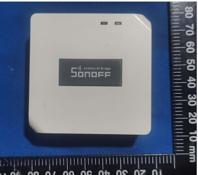
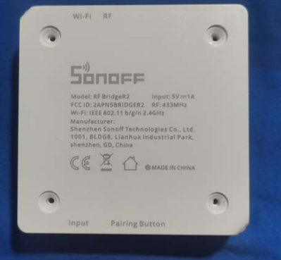
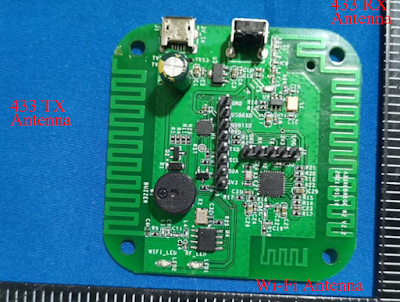
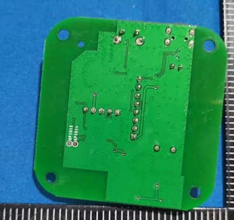
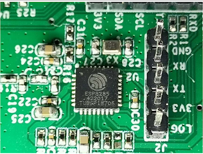

  

  

iTead has a new [433mhz Sonoff RF Bridge](http://shrsl.com/2xi9d) on the way.  The R2 just hit the FCC and internal photos are included! It looks like they are using the same molded case as the the [Zigbee Bridge](https://youtu.be/dC1AEyFhmnc) and first revision(s) of the RF Bridge used.  They've dropped that big LED as well.  One thing I'm not seeing is the RF chipset they used this time around.  But I do see the ESP8285 and header pins!  We probably won't see the pins soldered on in the production runs but it is a nice touch that they labeled everything for us and put standard header via holes.  It's almost like they want to continue making money off both sides of the community that use these.  Imagine that, what a concept, make something that sells.  

[FCC Docs](https://fcc.report/FCC-ID/2APN5BRIDGER2)

  

  

  

  

and the money shot!

  

  

[Previous RF Bridge Video](https://youtu.be/w_CchtI-oK0)

  

⚡**Products We Use/Recommend**  
Amazon US - [https://amzn.to/2YZNDeO](https://amzn.to/2YZNDeO)  
Amazon UK - [https://amzn.to/2TnG2R4](https://amzn.to/2TnG2R4)  
Amazon CA - [https://amzn.to/2JWsNq5](https://amzn.to/2JWsNq5)  
  

⚡**Be Social!**⚡  
Discord Chat - [https://discord.gg/bNtTF2v](https://discord.gg/bNtTF2v)  
Patreon - [https://www.patreon.com/digiblurDIY](https://www.patreon.com/digiblurDIY)  
Facebook - [https://www.facebook.com/groups/digiblurdiy](https://www.facebook.com/groups/digiblurdiy)  
Instagram - [https://www.instagram.com/digiblurdiy](https://www.instagram.com/digiblurdiy)  
Please note that links above may be affiliate link, using them could earn digiblurDIY a small commission of most purchases and helps with future video projects. Thank you!
