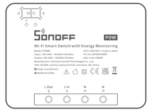
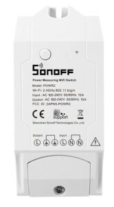
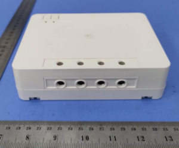
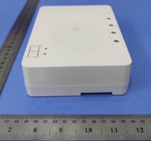
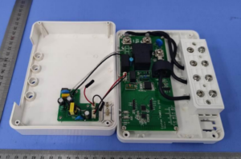
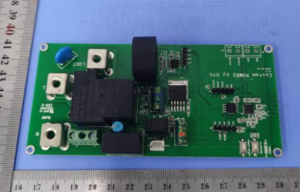
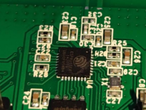
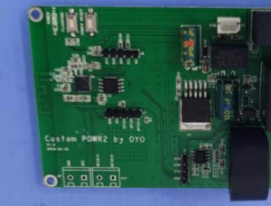

  

So every once in a while we seem to find some strange home automation product designs.  When I saw the name of [POW R3](https://shrsl.com/31kyj) come across the FCC docs as [2APN5-POWR3](https://fccid.io/2APN5POWR3) I was excited to see the new design.  If you aren't familiar with the previous model, [POW R2](https://geni.us/e3waX3) it was basically a large box at over 4 inches (114mm) long with power monitoring and a relay.  It definitely was a tank but its hard to park that tank in the garage!  

UPDATE: The page is live on [iTead](https://shrsl.com/31kyj) for the [POW R3](https://shrsl.com/31kyj) already!

(POW R2 - source itead.cc)

When iTead redesigned the new [Sonoff Dual in the R3](https://geni.us/2SFcYyE) revision, I was really impressed ([video link](https://youtu.be/VT6bY-iSveI)).  ESP32, dual switch inputs, dual power monitoring in small form factor design.  The new redesign of the POW is weird...it got bigger!

Pics from the [FCC Filing](https://fccid.io/2APN5POWR3)

  

  

  

  

  

  

First thoughts.  ESP8266!  WOOT!  Header pins and things labelled.  YES!  Great job OYO for thinking of the DIY community!  [Tasmota](https://tasmota.github.io/docs/) or [ESPHome](https://esphome.io/) is waiting to be installed.  What are these empty headers here?  Call me! 

By looking at the one exterior picture and the 100-240V 25A rating, I'm guessing this is meant for a DIN rail installation and not targeting the in-wall solutions like the [Dual R3](https://geni.us/2SFcYyE) is.  Did you see the size of this thing? Beefy! It is a rather odd design compared to things in the past from the jumper wires from the wiring terminals, separate power supply board, current sensing "donut", etc.  I was surprised to see the ESP8266 and not the ESP8285 but they might have needed the additional storage for the onboard power monitoring history in the stock firmware.  The ESP32 might have been the better choice here as it doesn't appear many cost saving measures were taken into consideration and that would have allowed to do that sweet bluetooth pairing.

The last interesting piece was the relay, looking at the datasheet it appears the relay is a normally closed design.  This means even if the device is not powered then electricity will flow through the switch circuit.  This is very different from their devices in the past.  For instance if you take the [Sonoff S31 Washer/Dryer project video](https://youtu.be/q6aCfDDEkwE), you want these devices to be powered at all times usually.  This means the ESP chip needs to be powered and it is sending a signal to the relay to allow electricity to pass as the relay in the smart plug is normally open without a signal present.  While this might not be an issue in most cases, it is still a waste of energy and if the relay fails, it will not pass power anymore. Nice touch to see this choice of a relay. 

I'm looking forward to seeing this on the bench when it is released.  I'll ponder a 25A load test until then....

Source - [FCC Docs](https://fccid.io/2APN5POWR3)

⚡Products We Use/Recommend  
Amazon US - [https://amzn.to/2YZNDeO](https://amzn.to/2YZNDeO)  
Amazon UK - [https://amzn.to/2TnG2R4](https://amzn.to/2TnG2R4)  
Amazon CA - [https://amzn.to/2JWsNq5](https://amzn.to/2JWsNq5)  
  

⚡Be Social!⚡

YouTube - [https://youtube.digiblur.com](https://youtube.digiblur.com/)  
Discord Chat - [https://discord.digiblur.com](https://discord.digiblur.com/)  
Patreon - [https://patreon.digiblur.com](https://patreon.digiblur.com/)  
Facebook - [https://facebook.digiblur.com](https://facebook.digiblur.com/)  
Instagram - [https://instagram.digiblur.com](https://instagram.digiblur.com/)  
_Please note, the product links above could be affiliate links, using them could earn digiblurDIY a small commission of most purchases and helps with future video projects. Thank you!_
