  

[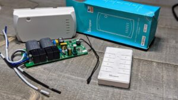](/wp-content/uploads/2021/07/PXL_20210707_003507719.PORTRAIT.jpg)

While chatting on Discord we got on the smart ceiling fan controller options or lack thereof.  Long story short there's a new listing for the [Sonoff iFan04](https://shrsl.com/34jpq) controller.  Could it be?!?!  Did they finally listen to several of us and do a fan controller with 120VAC fans in mind?  YUP!  They sure did.  Is it ESP82xx based so we can put Tasmota or ESPHome on it?  Absolutely!  

[**Buy from iTead**](https://shrsl.com/34jpq)

[**Buy on Amazon**](https://geni.us/zyTb3)

Let's take a few steps back.  So what is it?  The iFan0x controller is designed to address a common problem many people have with wiring.  In older homes there would be one light switch in a bedroom to control the fan and light together.  If this switch was turned off, both the light and fan went off.  Of course in the past 20+ yrs that did change in many areas where they ran an additional hot wire in the bundle and have a 2 gang switch for light and fan.  Instead of a costly rewire the iFan controller steps in to fill the gap.  It's designed to receive the one hot wire and breaks it out two switched wires, one for the light and another with 3 fan speeds. The controller also include a wireless 433mhz remote to control the speeds and light.  

The one big drawback I found is the size of the unit, it might not fit in some fan housings/junction boxes.  Then lastly how do you control it from the wall to follow my rule of "Never remove functionality while adding functionality."  The remote?  Or how about a real wall switch? (see the end of this article)

[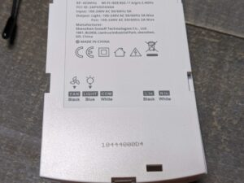](/wp-content/uploads/2021/07/PXL_20210707_003413955.jpg)

The previous iFan02/iFan03 worked great except in regions of the world with 120V AC power.  Many of us found the medium and slow speeds were just unusable.  This was due to the fact the capacitors that are switched in were undersized for normal 120V ceiling fans.  There were a couple solutions of using external capacitors or even finding replacement capacitors.  I did a [video setup guide](https://youtu.be/XCEPluSvLv8) of using two Martin Jerry dimmers in a pseudo 3 way configuration to control the modified iFan03 and downlights.  I still use it today and it works great!  But I know unsoldering and soldering big capacitors combined with even finding the right ones is not for everyone.  After the video I contacted a PR lead at iTead and...

`<table align="center" cellpadding="0" cellspacing="0" style="margin-left: auto; margin-right: auto;"><tbody><tr><td style="text-align: center;"></td></tr><tr><td style="text-align: center;">Click for larger view</td></tr></tbody></table>`

Then the "fun" of 2020 hit..fast forward to 2021 and it's here!  All with the dual 5uF glory inside! Basically the same unit layout but with different sized fan speed capacitors.

I connected it to my ceiling fan and checked the amperage pulls of low, medium and high and all is well just as expected.  Remote works, lights toggle, etc.  Nice job iTead!

`<table align="center" cellpadding="0" cellspacing="0" style="margin-left: auto; margin-right: auto;"><tbody><tr><td style="text-align: center;"></td></tr><tr><td style="text-align: center;">My fan was showing 0.17 amps on low. Nice!</td></tr></tbody></table>`

  
What about local integration into Home Assistant?  I flashed mine with Tasmota without any soldering or even a screwdriver for that matter.  There's an ESP8285 onboard which is just an ESP8266 with onboard flash memory.  iTead was so nice to keep the same pin header broken out for us and the button is still GPIO zero to put the device in bootloader mode. It's almost like they want our money or something?

  

[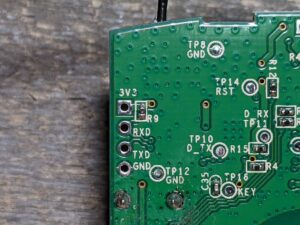](/wp-content/uploads/2021/07/PXL_20210707_012001494.jpg)

I used some male to female jumper wires from a USB TTL adapter just like you would with the Sonoff Basic.  Make sure you use 3.3volts!  RXD goes to TX on the adapter and TXD goes to RX.  I prefer to use an [inline USB switch cable](https://geni.us/Dsqxpe) to make it easy to toggle power while holding down the button on the unit for the first few seconds of boot up.

[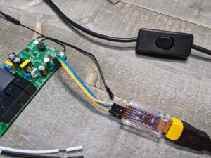](/wp-content/uploads/2021/07/PXL_20210707_011707806.jpg)

  

`<table align="center" cellpadding="0" cellspacing="0" style="margin-left: auto; margin-right: auto;"><tbody><tr><td style="text-align: center;"></td></tr><tr><td style="text-align: center;">No soldering.&nbsp; Just slip them in the holes.</td></tr></tbody></table>`

  

`<table align="center" cellpadding="0" cellspacing="0" style="margin-left: auto; margin-right: auto;"><tbody><tr><td style="text-align: center;"></td></tr><tr><td style="text-align: center;">Remote works for a little downward pressure to keep the wires in place</td></tr></tbody></table>`

  

Apply the regular Tasmota bin file and attach it to your WiFi. No special templates are needed for the iFan04. Go to Configure Module

  

[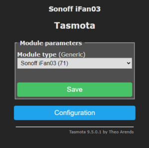](/wp-content/uploads/2021/07/ifan03_04.png)

Select iFan03.  **(NO TEMPLATE NEEDED!)**

Configure your MQTT broker and topic.  Set your custom name if you want.

[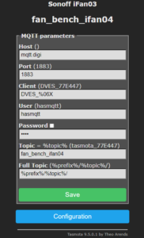](/wp-content/uploads/2021/07/mqtt_settings.png)

  

[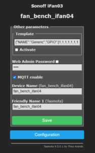](/wp-content/uploads/2021/07/configure_other.png)

  

It will automatically pop into the Tasmota Home Assistant Integration without any special YAML code or templating.  It really is that simple and all local!  Probably one of the easiest ones to do in my opinion.  If you need some help, feel free to jump into Discord Chat - [https://discord.com/invite/dgRZSw6](https://discord.com/invite/dgRZSw6)

  

[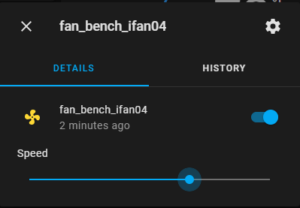](/wp-content/uploads/2021/07/cards_fan_ifan04.png)

  

[**Buy from iTead**](https://shrsl.com/34jpq)

[**Buy on Amazon**](https://geni.us/zyTb3)

[Check out](https://youtu.be/XCEPluSvLv8) how I used a dimmer to see the fan speeds at a glance and control the fan and lights.  If you'd like to see an updated redo of this procedure now that things are a little easier with integrations and controllers let me know below.

More photos below...

[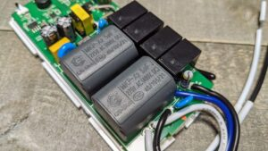](/wp-content/uploads/2021/07/PXL_20210707_002743451-1.jpg)

  

  

[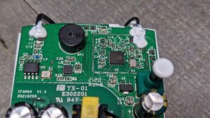](/wp-content/uploads/2021/07/PXL_20210707_002943979.jpg)

  

[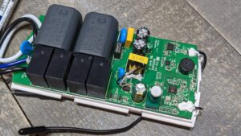](/wp-content/uploads/2021/07/PXL_20210707_003036429.jpg)

  

[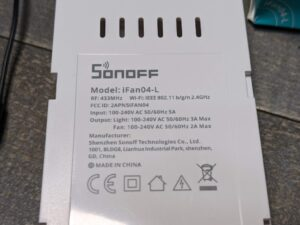](/wp-content/uploads/2021/07/PXL_20210707_003406167.jpg)

  

  

`<table align="center" cellpadding="0" cellspacing="0" style="margin-left: auto; margin-right: auto;"><tbody><tr><td style="text-align: center;"></td></tr><tr><td style="text-align: center;">All in the name of testing</td></tr></tbody></table>`

<!--truncate-->

⚡Products We Use/Recommend  
Amazon US - [https://amzn.to/2YZNDeO](https://amzn.to/2YZNDeO)  
Amazon UK - [https://amzn.to/2TnG2R4](https://amzn.to/2TnG2R4)  
Amazon CA - [https://amzn.to/2JWsNq5](https://amzn.to/2JWsNq5)  
  

⚡Be Social!⚡

Main Website: 🌐 https://digiblur.com/ 
Discord Chat: https://discord.com/invite/dgRZSw6 
Patreon: https://www.patreon.com/digiblurdiy 
Join YouTube: https://www.youtube.com/@digiblurDIY/videos  
Facebook: https://www.facebook.com/groups/digiblurdiy 
Instagram: https://www.instagram.com/digiblurdiy  
_Please note, the product links above could be affiliate links, using them could earn digiblurDIY a small commission of most purchases and helps with future video projects. Thank you!_
