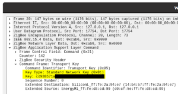

M.J. Wydra [https://github.com/Tediore](https://github.com/Tediore)_Discord: Tediore#8266_

  
  

Synopsis

This guide will explain how to sniff the network key from a Zigbee hub. The network key encrypts all messages sent between devices on a Zigbee network. When pairing a device, the coordinator sends the network key to the device which is encrypted with another key called the link key. There is a default link key called the well-known link key that all Zigbee devices use to encrypt the network key if no other link key is specified at the time of pairing (such as one generated with an installation code that is unique to the device being paired and is shared with the Zigbee software at the time of pairing). This guide assumes that the default link key is used.

<!--truncate-->
  

Objective

Sniffing the network key from a hub can be useful when you want to see what Zigbee messages a manufacturer’s hub is sending to a paired device when performing certain actions such as changing settings on the device. This could assist you in adding that functionality to your Zigbee software of choice. At the time of writing this guide, I was in the process of sniffing Zigbee messages between a manufacturer’s hub and device so that I can hopefully add support for certain device functions in Zigbee2MQTT ([https://www.zigbee2mqtt.io/](https://www.zigbee2mqtt.io/)).

  
  

Disclaimer

This guide is provided for educational and research purposes. Only perform this procedure on devices that you actually own. I do not promote the use of this guide for illegal and/or unethical activities, nor can I be held liable for any legal repercussions that you might face from using this guide for any other purpose.

  
  

Requirements

This process requires a Zigbee adapter and two pieces of software. One piece of software is determined by the adapter you’ll be using for sniffing traffic. The adapter I use to sniff traffic is the GoControl HUSBZB-1 which requires the ZigBeeSniffer.jar sniffing software (which also requires Java to be installed). The second piece of software is Wireshark ([https://www.wireshark.org/](https://www.wireshark.org/)) and is used no matter what Zigbee adapter you use. This guide assumes you’ll be using the HUSBZB-1. This guide also assumes you’re using Linux (such as Debian or Ubuntu). You can use Windows for this process, but this guide will not cover that, nor will it explain how to install Wireshark or Java.

  

NOTE: If you want to use Windows and/or a CC2531 Zigbee adapter for sniffing, information can be found at [https://www.zigbee2mqtt.io/how\_tos/how\_to\_sniff\_zigbee\_traffic.html](https://www.zigbee2mqtt.io/how_tos/how_to_sniff_zigbee_traffic.html#with-cc2531). 

Once you follow that procedure, you can start at step 5 in this guide and skip steps 10 and 11.

  

  

Procedure

1. Download ZigBeeSniffer.jar from [https://github.com/zsmartsystems/com.zsmartsystems.zigbee.sniffer](https://github.com/zsmartsystems/com.zsmartsystems.zigbee.sniffer)
    
2. Download and install Wireshark from [https://www.wireshark.org/](https://www.wireshark.org/)
    
3. Download and install Java (if necessary).
    
4. Start Wireshark.
    
5. In Wireshark, navigate to Edit > Preferences, then double-click Protocols.
    

  

6. Start typing zigbee to snap straight to Zigbee instead of scrolling endlessly.
    

7. Click Edit… next to Pre-configured Keys, then click the + in the lower left.
    

  

8. Add the well-known link key (5A6967426565416C6C69616E63653039) with a byte order of Normal (the default) and add whatever label you'd like.
    

  

9. Click OK, and then click OK again to return to the main menu.
    
10. Plug in your Zigbee adapter, open a terminal window, and type java -jar /path/to/ZigBeeSniffer.jar -baud 57600 -flow hardware -port /path/to/adapter. Replace /path/to/ZigBeeSniffer.jar with the path to the .jar file you downloaded in step 1, and replace /path/to/adapter with the path to your Zigbee adapter. In the case of the HUSBZB-1, the path you will want to use is /dev/serial/by-id/usb-Silicon\_Labs\_HubZ\_Smart\_Home\_Controller\_51300257-if01-port0.

  
NOTE: If you happen to know what Zigbee channel the hub uses, you can specify that in the command with \-c X where X is the Zigbee channel.

  

11. Return to Wireshark, select the Loopback: lo interface, type udp port 17754 in the filter field, and then click the Start capturing packets button in the upper left (looks like a blue shark fin). If you have a Zigbee network of your own set up already, you will start to see encrypted packets which you can ignore.
    

  

12. Enable pairing mode on the hub and on whatever Zigbee device you’re pairing to the hub, such as a smart light. The procedure to do so varies by manufacturer and device.
    

13. You should now see packets in the Wireshark capture screen (if you aren’t already seeing some from your own network).
    

  

14. Wait until the device has been successfully paired to the hub, then click the Stop capturing packets button to the right of the shark fin (looks like a red square).
    

  

15. Click on the Info column to sort the packets in alphabetical order by info type.
    

  

16. Scroll down until you see Transport Key in the Info column.
    

  

17. Double-click the first one you see. This will bring up a new window with information on the packet.
    

  

18. Double-click Zigbee Application Support Layer Command, then double-click Command Frame: Transport Key. If you see Standard Network Key next to Key Type, then the value next to Key is the Zigbee network key. Congrats! Right-click the Key row and click Copy, then Value.
    

NOTE: If you see Trust Center Link Key next to Key Type instead, then click Close and double-click the next Transport Key packet which will likely contain the network key.

19. Repeat steps 5 through 9 using the network key you just copied instead of the well-known link key.
    

  

20. Start capturing packets again.
    

  

21. Carry out some actions on the device (e.g., if the device is a light, turn it on/off, change the brightness, etc.) and you should see decrypted Zigbee messages in the capture window. Have fun!
    

  

Important note

The Zigbee spec allows for the network key to be periodically changed. Whether this will actually occur or not depends on the Zigbee software used (the firmware that a hub uses, for example). If this does occur, the network key that you sniffed will no longer be able to decrypt the Zigbee messages on the network, and you will need to complete this procedure again.

  
  

References

[https://www.silabs.com/documents/public/application-notes/an1233-zigbee-security.pdf](https://www.silabs.com/documents/public/application-notes/an1233-zigbee-security.pdf)

[https://www.zigbee2mqtt.io/how\_tos/how\_to\_sniff\_zigbee\_traffic.html](https://www.zigbee2mqtt.io/how_tos/how_to_sniff_zigbee_traffic.html)
