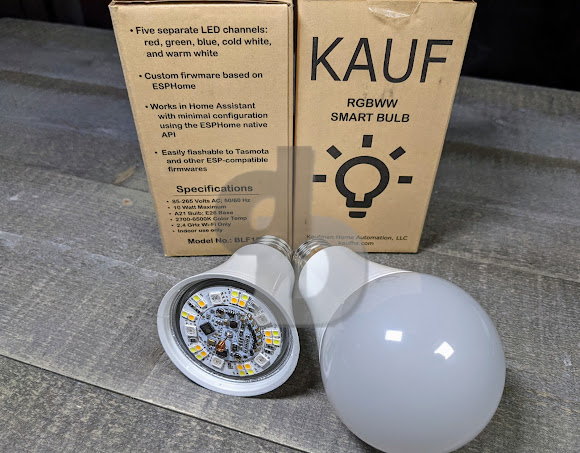
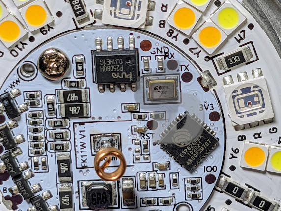

Someone has finally done it, a bulb with an oh sh!$ recovery method!  The [Kauf BLF10 Bulb](https://geni.us/kaufbulb) is on Amazon and **preflashed** with [ESPHome](https://esphome.io/).  Yes, you can also install other open source ESP8266 projects such [Tasmota](https://tasmota.github.io/docs/), [WLED](https://kno.wled.ge/), etc by simply using your web browser.  No exploits, no hacks, no soldering, no wires, take it out of the box and go.  

<!--truncate-->

[Purchase and skip the reading (Amazon)](https://geni.us/kaufbulb)

[](https://1.bp.blogspot.com/-FPFVLlbi8GY/YUFAMbSGb0I/AAAAAAAEvxA/prs2i5BoZacZMr_X_xVKm0ok9J2nmeqTACLcBGAsYHQ/s3824/kauf_box2.jpg)

The bulb is a 10W LED (not to be confused with wattages stated as equivalent), I do not see a lumen rating at this time on the specifications but found the brightness by eye to be on par for a bulb of this size.  There are 5 independent color channels to this bulb; Red, Green, Blue, Cool White, and Warm White.  None of that 4 channel simulated warm white or cool white mess!  Keep in mind this is an A21 sized bulb that could have size issues fitting in some enclosures.  What's the added bonus?  

[](https://1.bp.blogspot.com/-ZwZ2elFUhMk/YUFAtAQ7myI/AAAAAAAEvxI/IU4tjHT3jgQjgfn9JJxsCu34tLrq2lrrACLcBGAsYHQ/s4032/kauf_pads.jpg)

Your eyes aren't deceiving you, those are indeed solder pads for 3V3, RX, TX, GND and GPIO Zero.  What does that mean?  Hardware Recovery if needed!  Unlike other bulbs that might have been converted to open source with Tuya Convert or maybe even [Athom preflashed bulbs](https://youtu.be/jz3T-U16RuY), they do not have the ability to be recovered from a bad upgrade, software failure, etc, but these definitely do.  For myself that means no worry at all switching over to WLED for the holiday season, switching to Tasmota, etc.  I know I can always break out the [USB TTL](https://geni.us/C35RP9) adapter and install my software without any issues. Great job Kauf!  

[Kaufman Home Automation](https://kaufha.com/products/) has done a great job on documenting everything you need for this bulb from custom YAML code with ESPHome, installation, converting to Tasmota, the [Tasmota Template](/p/smart-switch-templates.html), etc. all directly from the source.  Thanks to @tonyfav on the [digiblurDIY Discord](https://discord.com/invite/dgRZSw6) for digging through the [ESPHome code](https://github.com/KaufHA/BLF10) to see the blue channel needed a bit of tweaking since it was too strong in default use cases in Tasmota as well.  I've included this in the template below.  If you do find the blue channel is too bright use the following command in the Tasmota console to knock it down a bit.   

Tasmota Template (Paste it all on one line in the Tasmota Console):

```
backlog template {"NAME":"Kauf BLF10 Bulb","GPIO":[0,0,0,0,416,419,0,0,417,420,418,0,0,0],"FLAG":0,"BASE":18,"CMND":"RGBWWTable 255,255,153,255,255"} ; module 0
``` 

Individual Command if needed to limit the blue color:

RGBWWTable 255,255,153,255,255

[Kaufha.com](https://kaufha.com/products/) also has a [US/NA Smart Plug](https://geni.us/7rlBS5) PLF10 with power monitoring as well.  Be sure to check out their website for any new products, procedures, etc.  I purchased a couple of bulbs as soon as I heard about these as I definitely want to support the cause of some preflashed ESP based devices with Home Assistant! Hopefully we see their product line expand as they feel out the market and see what other products are requested.

`<table align="center" cellpadding="0" cellspacing="0" style="margin-left: auto; margin-right: auto;"><tbody><tr><td style="text-align: center;"><a href="https://1.bp.blogspot.com/-5gst7suFrVo/YUFBJrWTC5I/AAAAAAAEvxQ/KtjmY5wa92A6aKPMqzwWlRQ24knCgZiUQCLcBGAsYHQ/s3157/kauf_size2.jpg" style="margin-left: auto; margin-right: auto;"></a></td></tr><tr><td style="text-align: center;">Kauf Bulb (top) , 60w Incandescent (middle) , Kauf Bulb Diffuser top down</td></tr></tbody></table>`

  
[Kauf BLF10 Bulb](https://geni.us/kaufbulb)

[Kauf PLF10 Smart Plug](https://geni.us/7rlBS5)

  

⚡Products We Use/Recommend  
Amazon US - [https://amzn.to/2YZNDeO](https://amzn.to/2YZNDeO)  
Amazon UK - [https://amzn.to/2TnG2R4](https://amzn.to/2TnG2R4)  
Amazon CA - [https://amzn.to/2JWsNq5](https://amzn.to/2JWsNq5)  
  

⚡Be Social!⚡

Main Website: 🌐 https://digiblur.com/ 
Discord Chat: https://discord.com/invite/dgRZSw6 
Patreon: https://www.patreon.com/digiblurdiy 
Join YouTube: https://www.youtube.com/@digiblurDIY/videos  
Facebook: https://www.facebook.com/groups/digiblurdiy 
Instagram: https://www.instagram.com/digiblurdiy 
_Please note, the product links above could be affiliate links, using them could earn digiblurDIY a small commission of most purchases and helps with future video projects. Thank you!_
