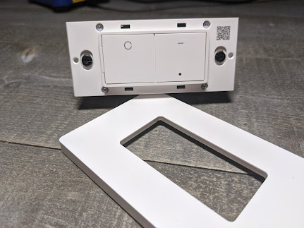

**Looking for How to Flash them?**  [Complete Flashing Guide](http://135.148.73.218:8080/p/linkind-esp32-smart-switch-how-to-flash.html) 

[**Buy the 1 pack on Amazon**](https://amzn.to/3ijr6RC)

[**Buy the 4 pack on Amazon**](https://amzn.to/3kOLrjx)

Can we flash Tasmota on it?  **YES!**  The [Linkind Smart Switch](https://amzn.to/3kOLrjx) is rather unique.  It uses an ESP32 chipset, two independent buttons, two independent LEDs (behind the small hole) of green/red and one relay.  It comes with a non branded white screwless decora faceplate.  The switch can also be used in multi-gang boxes as they have the additional mounting holes. 

⚡Products We Use/Recommend

Amazon US - [https://amzn.to/2YZNDeO](https://amzn.to/2YZNDeO)  
Amazon UK - [https://amzn.to/2TnG2R4](https://amzn.to/2TnG2R4)  
Amazon CA - [https://amzn.to/2JWsNq5](https://amzn.to/2JWsNq5)  
  

⚡Be Social!⚡

YouTube - [https://youtube.digiblur.com](https://youtube.digiblur.com/)  
Discord Chat - [https://discord.digiblur.com](https://discord.digiblur.com/)  
Patreon - [https://patreon.digiblur.com](https://patreon.digiblur.com/)  
Facebook - [https://facebook.digiblur.com](https://facebook.digiblur.com/)  
Instagram - [https://instagram.digiblur.com](https://instagram.digiblur.com/)  
_Please note, the product links above could be affiliate links, using them could earn digiblurDIY a small commission of most purchases and helps with future video projects. Thank you!_

  

Linkind _WS240010008_
