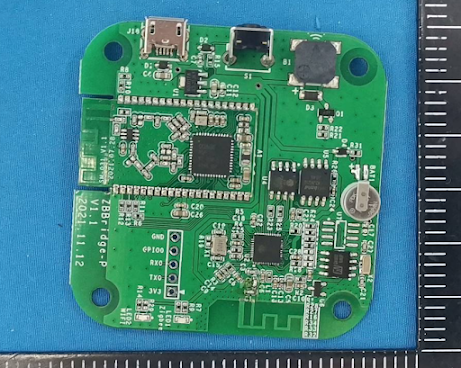
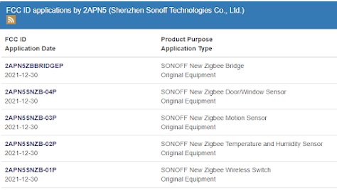
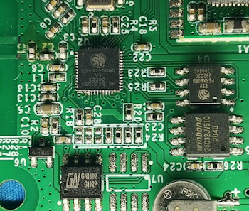
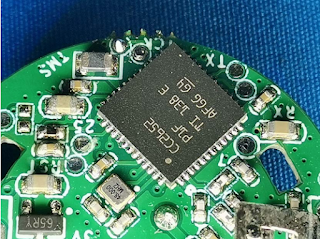

**UPDATE: Slated release March 2022**

And just like that iTead Sonoff drops the mic and busts out with some new Zigbee gear to hit the FCC to top of the fun of 2021.  I'm really hoping they got them right this time around.  The previous version motion sensor performed rather poorly and was full of issues in my motion sensor round up video.  The door sensor had battery contact issues for some users as well so here's and early drink to them pulling the nose up!  

So the really cool thing when I looked at the internal photos was the CC2652 chipset!  NICE!  It might be a little overkill'ish but I do get it from an economy of scale type thing.  Why not do it all CC2652?  The chipset works so well and they've hit a sweet spot with the USB CC2652 series coordinator, so it seems they are going all in with this chipset.  

On the release list is the button, temp/humidity sensor, motion sensor, door/window sensor and the Zigbee bridge.  I know what you are already thinking....is it ESP based?  YUP!  ESP32 and they even broke out the pins for us in via holes at standard pitch for what appears to be solderless flash for the DIY folks. Unfortunately or maybe fortunately for some, I do not see an Ethernet or POE based model but at least [ZigStar](https://zig-star.com/projects/zigbee-gw-lan/) and [Tube](https://www.tubeszb.com/) are breathing a sigh of relief with their ethernet based CC2652 based coordinators. Ethernet is preferred in the case of Zigbee since it also uses the 2.4ghz band and could interfere with itself if the channels for both interfaces are not chosen correctly.

Now the curiosity in me after doing the [long range Zigbee testing](https://youtu.be/QNOWCGL6gFE) got me thinking about custom firmware in various Zigbee devices to correct issues we seen from various devices like the [Aqara sensors becoming router "sticky" or not liking some routers](https://community.hubitat.com/t/xiaomi-aqara-devices-pairing-keeping-them-connected/623), Sonoff motion sensors failing to report motion when motion was in the room, Ikea upgrades, Linkind EFR SDK upgrades, etc.  Could we correct issues like this if necessary so we wouldn't have to buy stuff over again?

Would there be enough pins broken out to JTAG these?  Hard to say at this point but quite possibly it wouldn't be needed at all in these new versions.  Time will tell and I can't wait to get my hands on this lineup.  

If you get bored over the holidays go check out the FCC source documents and let me know if you find anything interesting.  Or go checkout some of our Zigbee videos.
  

Zigbee Bridge - [https://fccid.io/2APN5ZBBRIDGEP](https://fccid.io/2APN5ZBBRIDGEP)

Door/Window Sensor - [https://fccid.io/2APN5SNZB-04P](https://fccid.io/2APN5SNZB-04P)

Motion Sensor - [https://fccid.io/2APN5SNZB-03P](https://fccid.io/2APN5SNZB-03P)

Temp/Humidity Sensor - [https://fccid.io/2APN5SNZB-02P](https://fccid.io/2APN5SNZB-02P)

Button - [https://fccid.io/2APN5SNZB-01P](https://fccid.io/2APN5SNZB-01P)

  

⚡Products We Use/Recommend
Amazon US - [https://amzn.to/2YZNDeO](https://amzn.to/2YZNDeO)  
Amazon UK - [https://amzn.to/2TnG2R4](https://amzn.to/2TnG2R4)  
Amazon CA - [https://amzn.to/2JWsNq5](https://amzn.to/2JWsNq5)  

⚡Be Social!⚡
YouTube - [https://youtube.digiblur.com](https://youtube.digiblur.com/)  
Discord Chat - [https://discord.digiblur.com](https://discord.digiblur.com/)  
Patreon - [https://patreon.digiblur.com](https://patreon.digiblur.com/)  
Facebook - [https://facebook.digiblur.com](https://facebook.digiblur.com/)  
Instagram - [https://instagram.digiblur.com](https://instagram.digiblur.com/)  
_Please note, the product links above could be affiliate links, using them could earn digiblurDIY a small commission of most purchases and helps with future video projects. Thank you!  As an Amazon Associate I earn from qualifying purchases._
