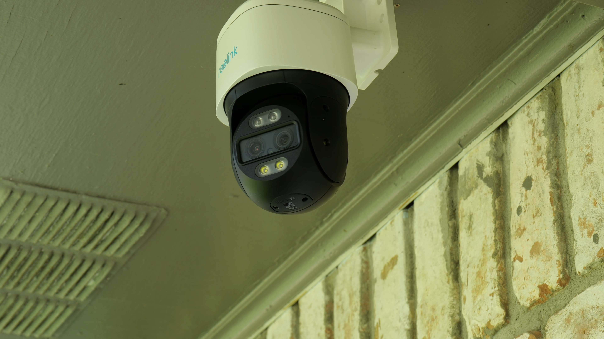
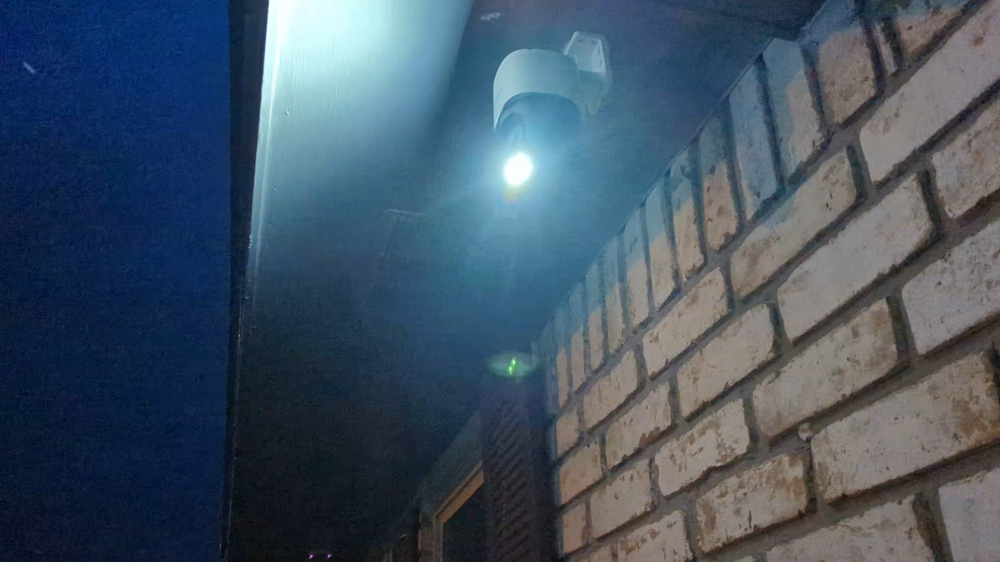
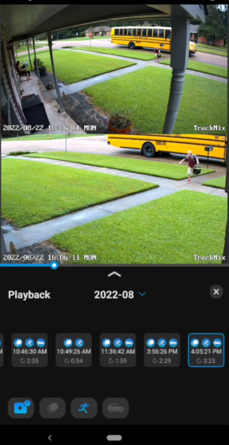
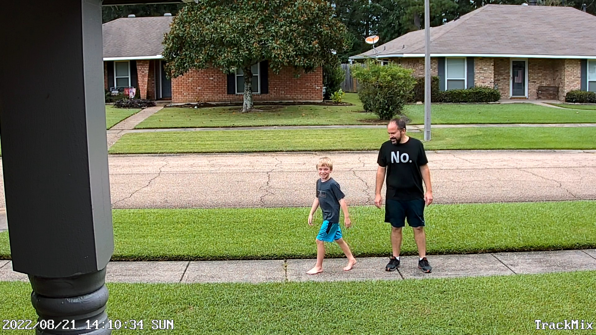
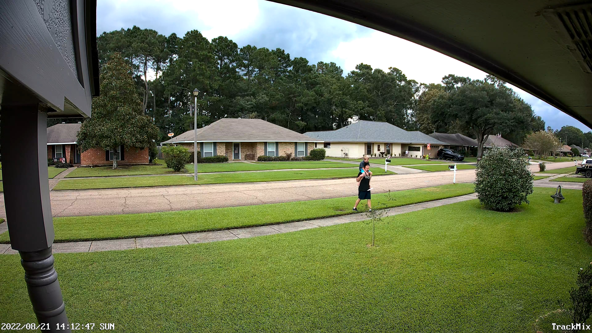
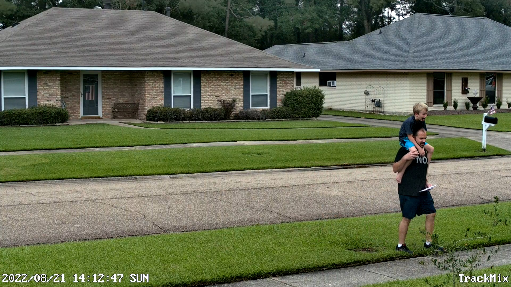
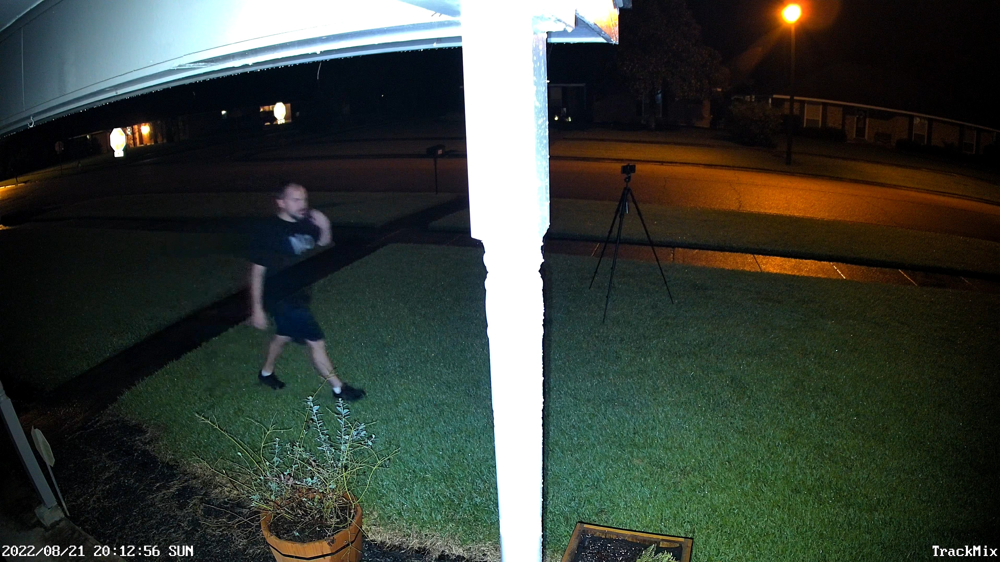
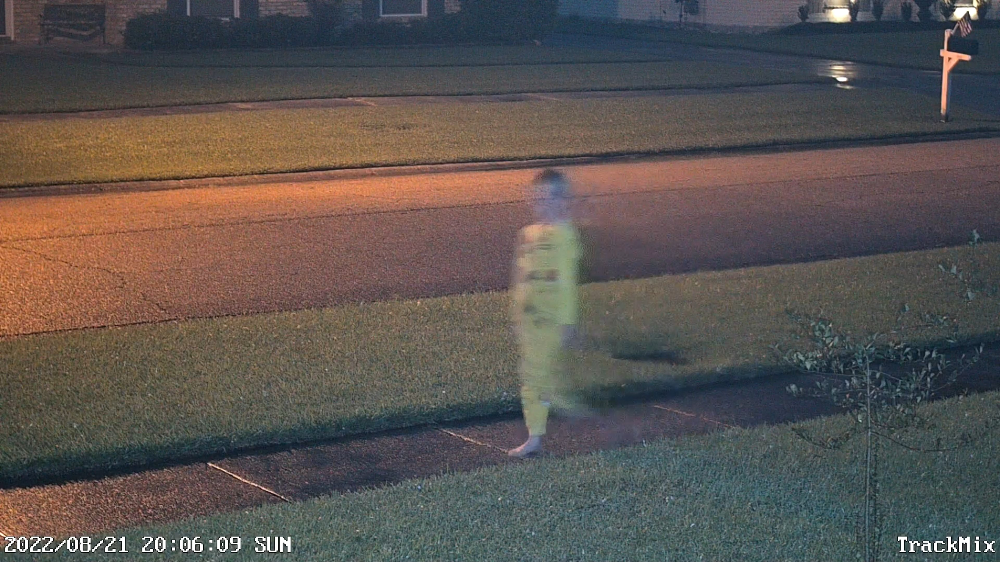

Reolink has upped their game a bit with the PTZ person tracking cameras.  The have dual lenses to catch the action and zoom in on subjects as needed.  It is quite a neat concept but being their first deep dive into this realm they have some issues to work on with the camera shake.  Check out the video and still shots below.

Direct from Reolink - [Trackmix POE](http://shrsl.com/3oiku) or [Trackmix Wi-Fi](http://shrsl.com/3oikx)
Or from [Amazon](https://amzn.to/3wJJYAF)  

<iframe allowfullscreen height="353" src="https://www.youtube.com/embed/3f6F_MXaI3Q" width="625" youtube-src-=""></iframe>  

## Pics

#### Mounted

<!--truncate-->

#### Spotlight

#### Mobile App

The mobile app shows both lenses at the same time in live view and playback.

#### Daylight Zoom Lens

OG and I splitting apart to see who it would follow.

#### Daylight Non Zoom Lens

#### Daylight Zoom Lens

#### Night Zoom Lens

Reolink still has a bit of a ghost effect with this camera.  I was unable to find a settings to remedy the situation.

#### Night Zoom Lens 2

