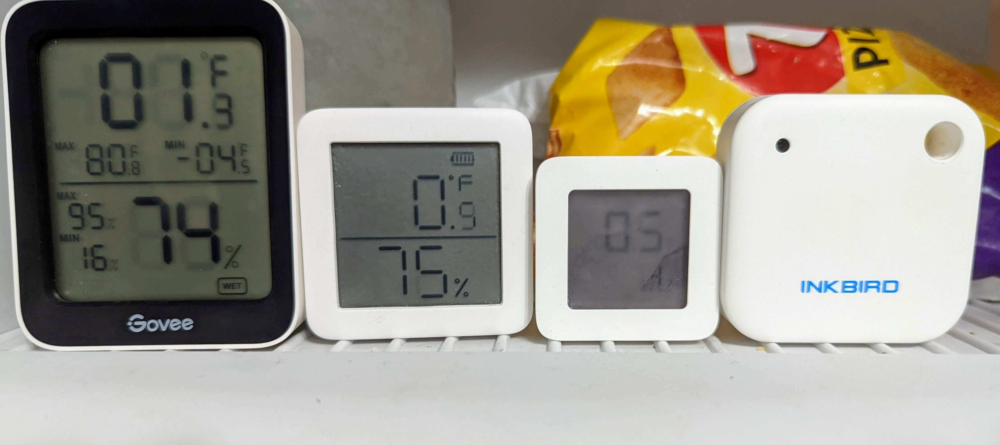
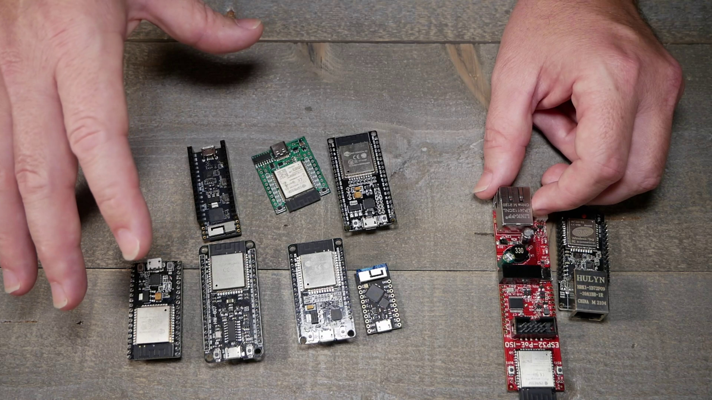
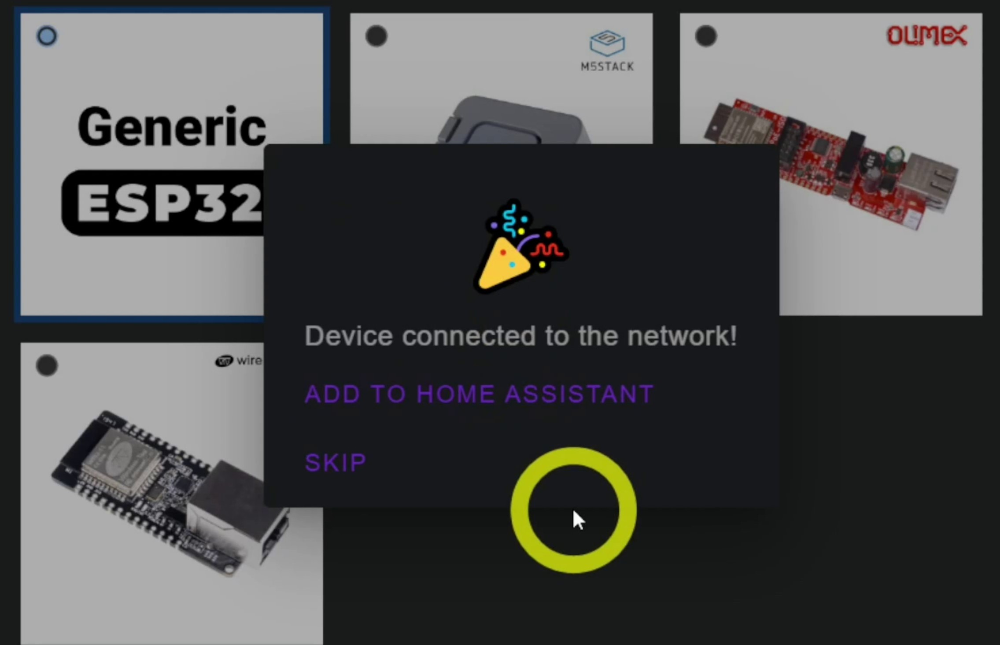
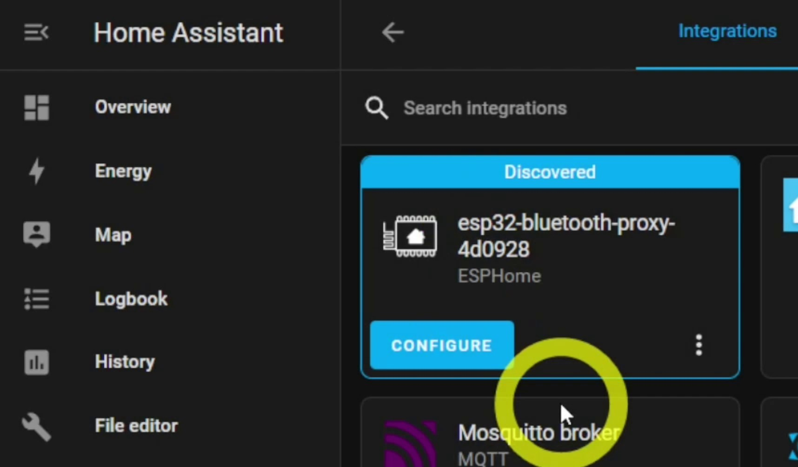
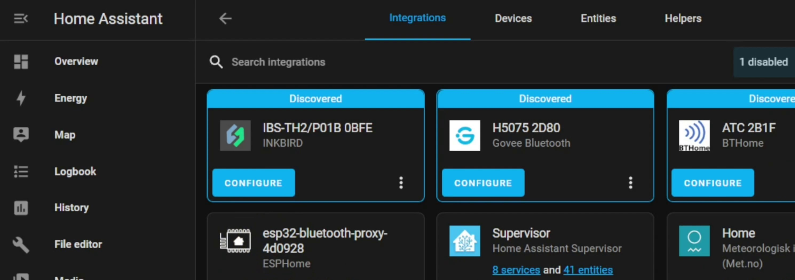
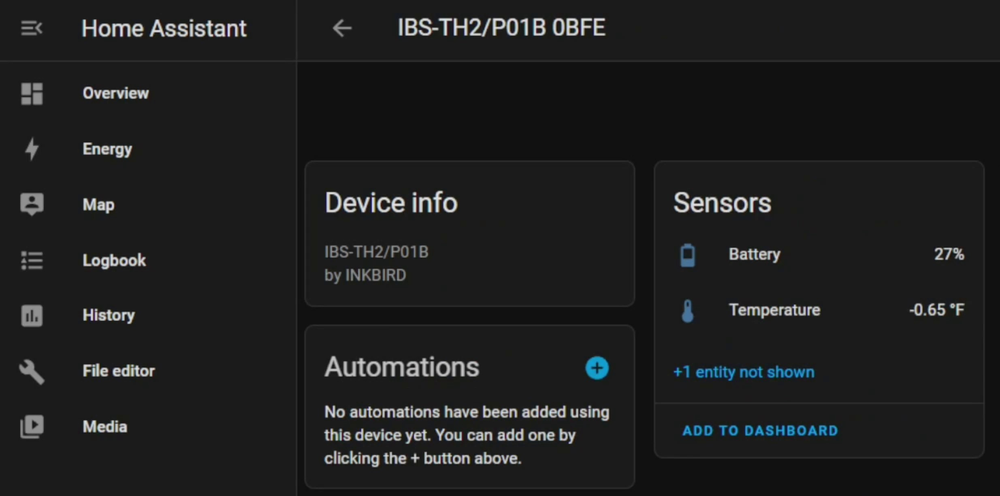

The crew at Home Assistant and ESPHome have done it again!  As of the 2022.9 release of Home Assistant you no longer need a USB adapter tied to the system.  All the issues of USB drivers, passthrough, etc with the various install types are gone!  Small and cheap ESP32 Nodemcus and other ESP32 devices become Bluetooth gateways for Home Assistant to use.  YES! you can use multiple proxies if you live in a McMansion to pick up all of the Bluetooth [temperature sensors](https://s.click.aliexpress.com/e/_AUojlM), [freezer sensors](https://amzn.to/3RqMWlI), and more.  

Purchase: [ESP32 NodeMCU](https://geni.us/esp32proxy) or [ESP32 POE Ethernet](https://www.mouser.com/ProductDetail/Olimex-Ltd/ESP32-POE-ISO?qs=unwgFEO1A6vVfCRbLeeCIw%3D%3D) or [ESP32 M5Stack](https://shop.m5stack.com/products/atom-lite-esp32-development-kit)



## digiblurDIY How To Video
<iframe allowfullscreen height="353" src="https://www.youtube.com/embed/1VXktM03pVs" width="625" youtube-src-=""></iframe> 

## How To



**Make sure Home Assistant is upgraded to 2022.9 or later.**   
Connect the ESP32 to the computer and visit the [ESPHome Blueooth Proxy Install Site](https://esphome.github.io/bluetooth-proxies/) via a Chrome Browser

<!--truncate-->

If you are using a regular NodeMCU ESP32 select generic otherwise select the other type(s).



**Wait for the install to complete, enter your WiFi credentials, and wait for the connected to network message.**



**Open Home Assistant and add the ESPHome Node to the system.  Auto discovery will start to populate as the sensors are scanned in.**



## Freezer Sensor Entities



## Existing ESPHome ESP32 Devices

If you have an existing ESP32 based device and want to enable Bluetooth Proxy add the following YAML code to the device.  NOTE: API must be enabled for the device.

```yaml
esp32_ble_tracker:
  scan_parameters:
    active: true
bluetooth_proxy:
  active: true
```

⚡Products We Use/Recommend  
Amazon US - [https://amzn.to/2YZNDeO](https://amzn.to/2YZNDeO)  
Amazon UK - [https://amzn.to/2TnG2R4](https://amzn.to/2TnG2R4)  
Amazon CA - [https://amzn.to/2JWsNq5](https://amzn.to/2JWsNq5)  

⚡Be Social!⚡  
YouTube - [https://youtube.digiblur.com](https://youtube.digiblur.com/)  
Discord Chat - [https://discord.digiblur.com](https://discord.digiblur.com/)  
Patreon - [https://patreon.digiblur.com](https://patreon.digiblur.com/)  
Facebook - [https://facebook.digiblur.com](https://facebook.digiblur.com/)  
Instagram - [https://instagram.digiblur.com](https://instagram.digiblur.com/)  
_Please note, the product links above could be affiliate links, using them could earn digiblurDIY a small commission of most purchases and helps with future video projects. Thank you!  As an Amazon Associate I earn from qualifying purchases._
