Reolink has released their doorbell cameras finally!  digiblur DIY Video below or scroll past if you simply want to see frames from the camera itself and skip the video.

Purchase from Reolink - [Wi-Fi](http://shrsl.com/3ulzj) or [PoE](http://shrsl.com/3ulzg) (Power over Ethernet)  
Purchase from [Amazon](https://amzn.to/3XwhxSd)   

<iframe allowfullscreen height="353" src="https://www.youtube.com/embed/xJ1RhdtU2Z8" width="625" youtube-src-=""></iframe>    

It is available in two flavors.  [PoE](http://shrsl.com/3ulzg) and [Wi-Fi](http://shrsl.com/3ulzj) directly from Reolink.com.  The doorbell camera comes with an external wireless chime that is power via a normal wall receptacle in the home.  The home automation DIY'ers can also pick up this signal via 433mhz receivers for automation fun as well.  If you have the Reolink NVR this camera integrates right into the system but if not you can also use the on-board micro SD card for recordings.  

Does it support RTSP/ONVIF?  Can I use it with Blue Iris or Frigate?  Kinda sort of not really!  As of this current firmware the RTSP codec has typical Reolink issues with dropped frames.  The video looks jerky but does work.  I'm still hoping for Reolink to fix their various codec issues in there cameras but they still can't seem to get that part right. 

### Pics / Still Frames

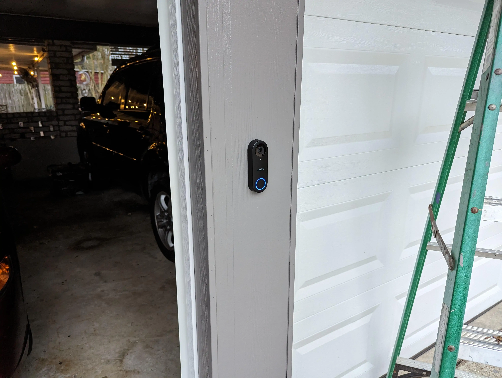
Read more  👉
<!--truncate-->
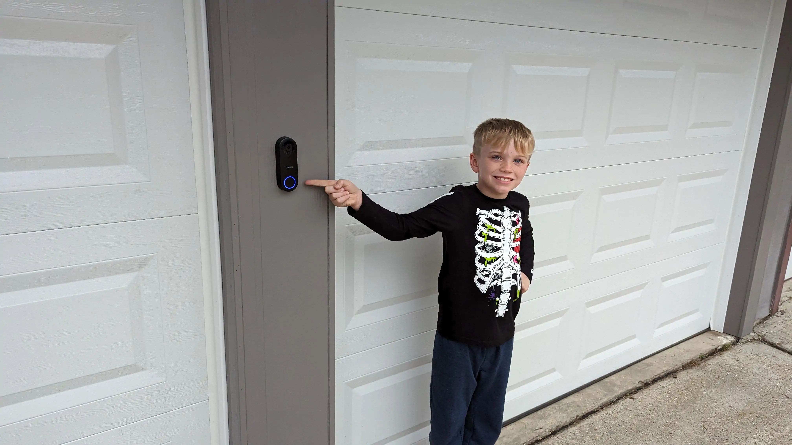

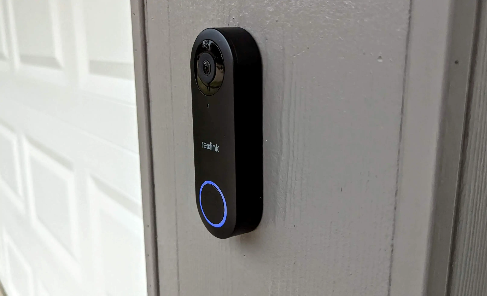
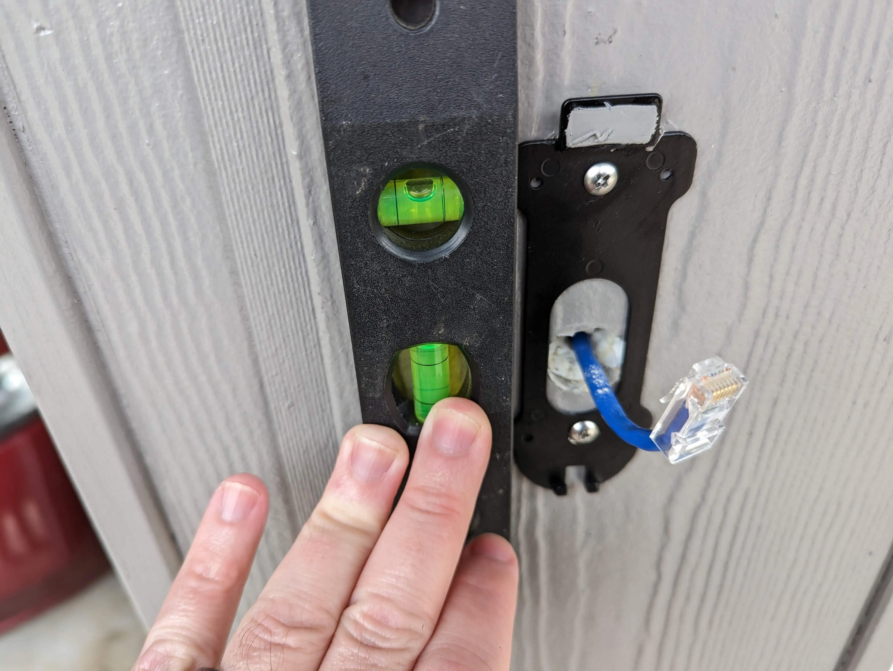
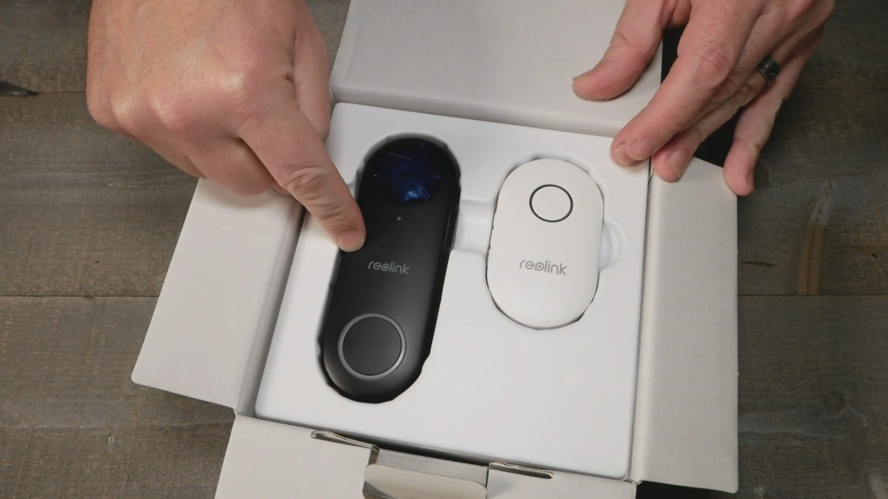
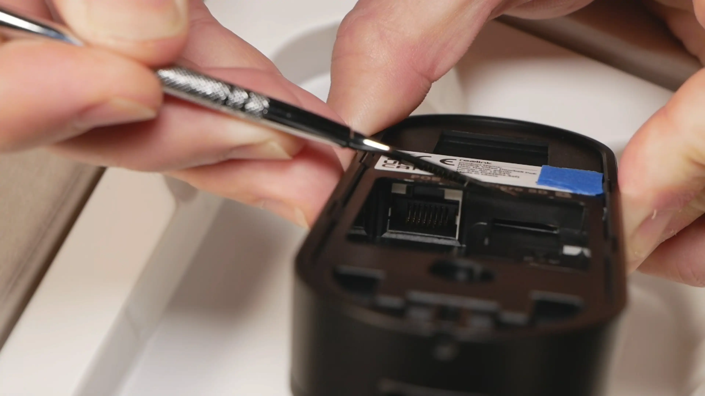
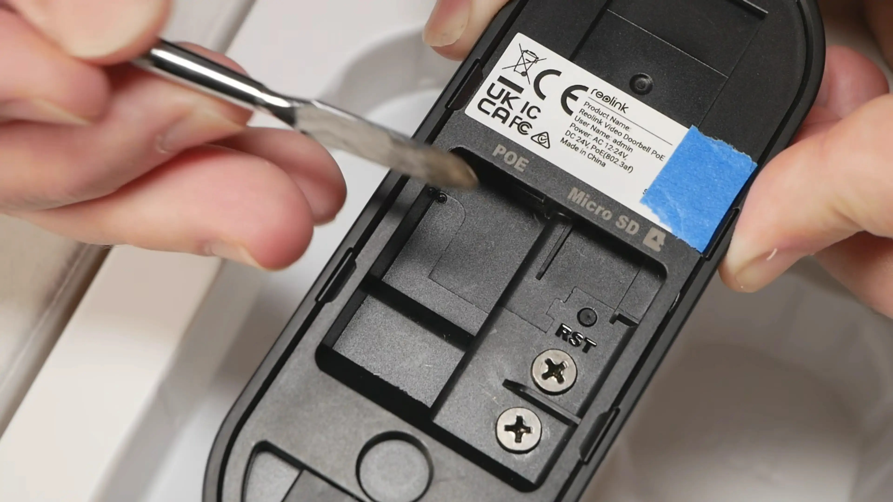
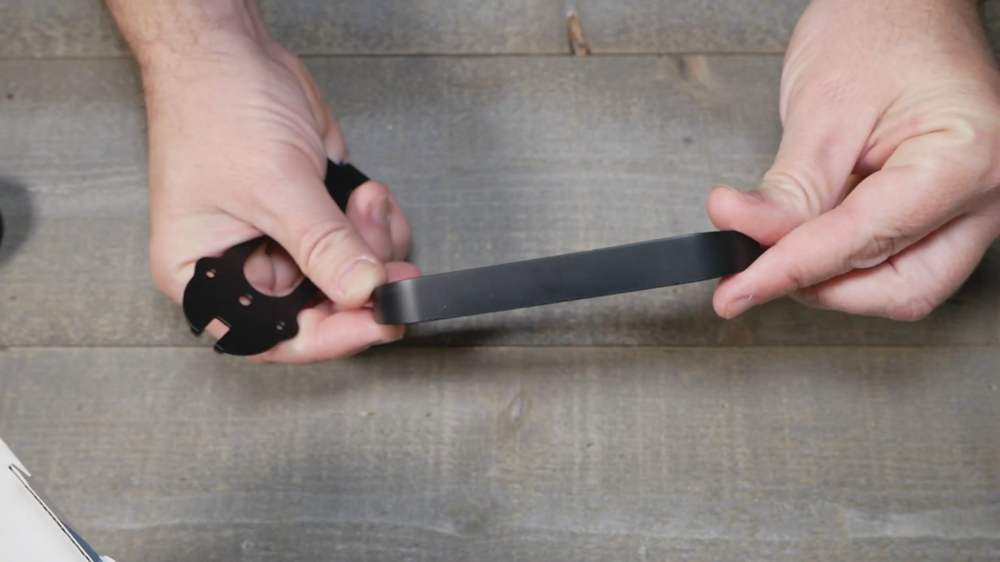
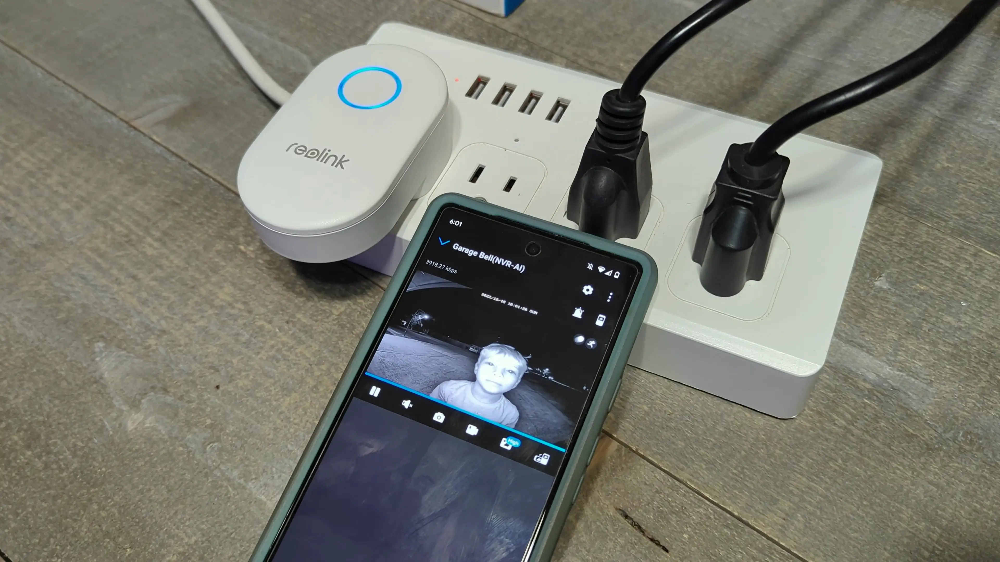
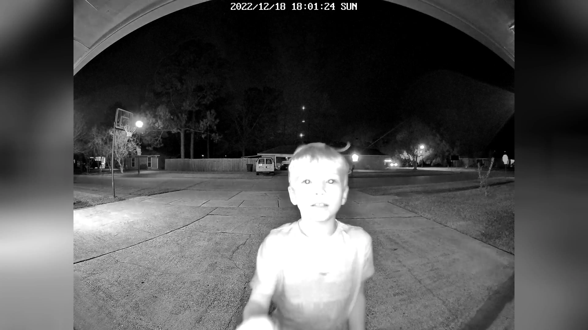
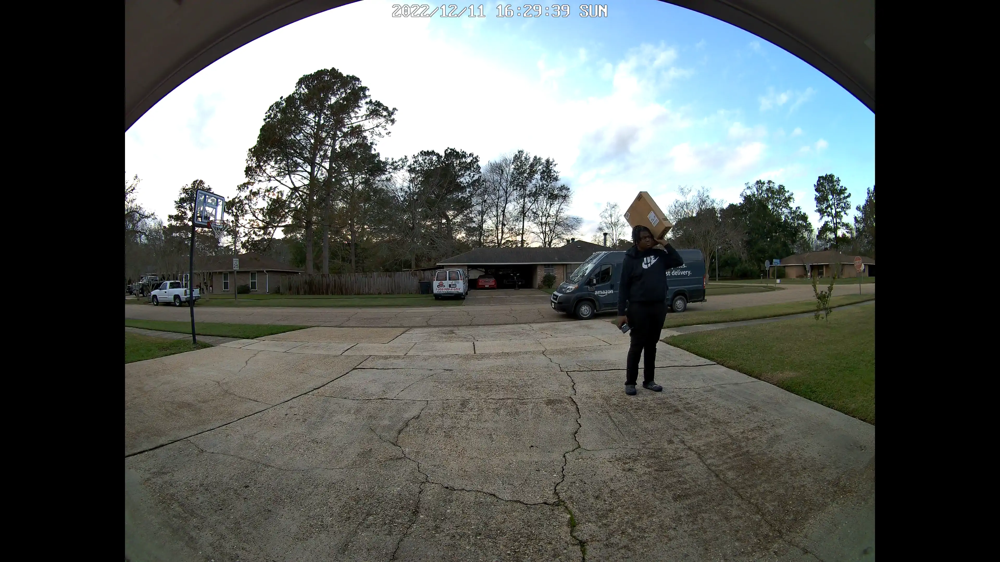
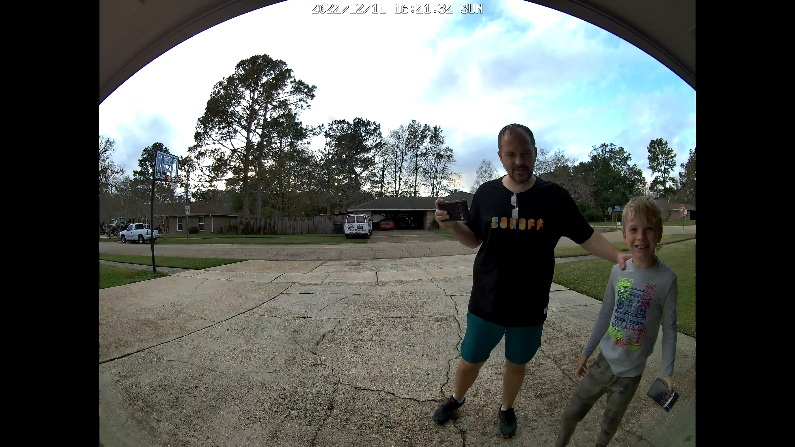
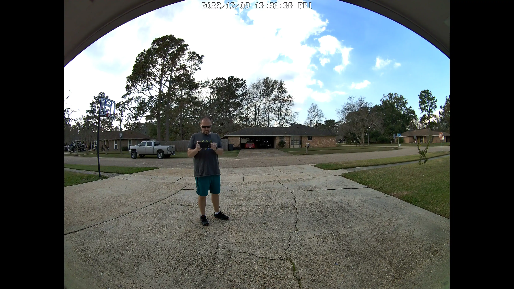
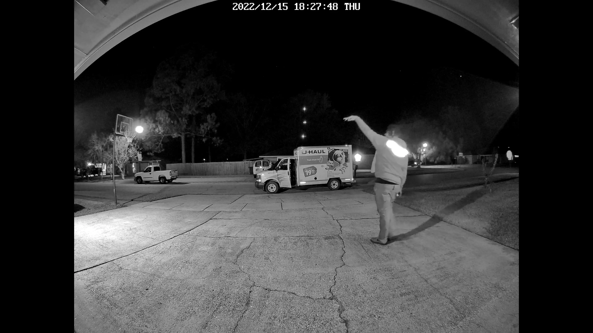

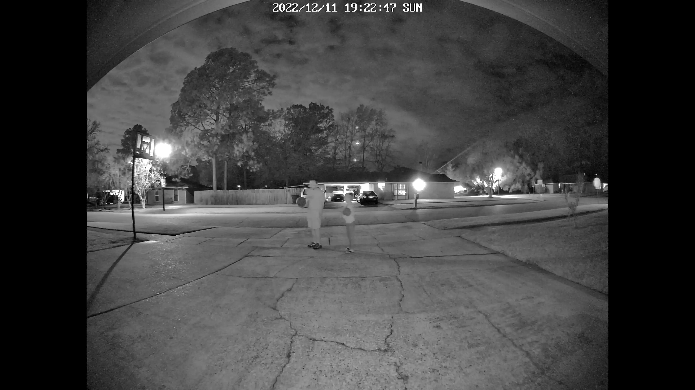
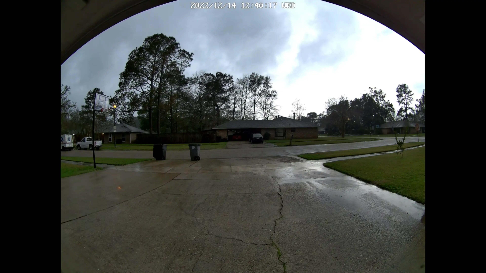