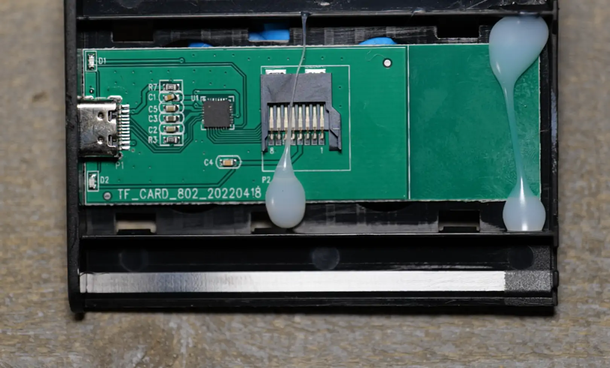
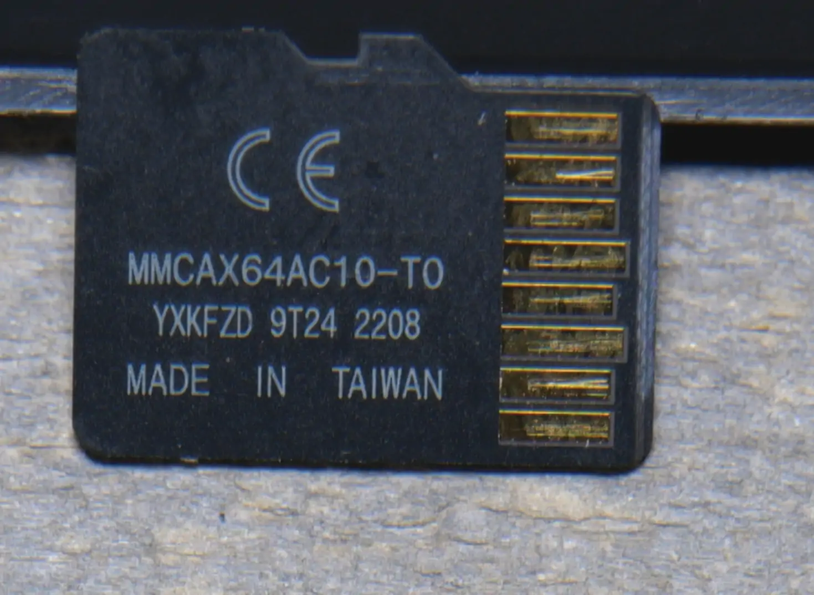

When things are too good to be true they probably are!  Just like the old scams of the knock-off 1TB SD cards but this one is a little different take on it.  The whole scam is for someone to buy these, throw a few files on them and wait for the ticking time bomb to hit later much later after the return period expired.  They are advertised as 8TB or 16TB drives when they are simply 64GB cheapo micro SD cards inside.  See the digiblurDIY video below

<iframe allowfullscreen height="353" src="https://www.youtube.com/embed/YBV95OdGD-s" width="625" youtube-src-=""></iframe>    

Spread the word to friends & family members, turn in these sellers, etc with these scammers whenever you can.  The [GOPALIWEN Amazon Listing](https://amzn.to/3XzP1ic) below was luckily removed shortly after the video published.  It is simple to pick them out based on just scanning for the large drives with cheap prices.  Stick to the major brands such as Samsung, Sandisk, Wester Digital, Crucial, etc., and price them appropriately.  If they are too cheap, don't buy them!  Be sure to always test and check out your drives before the return period expires no matter the brand.

### Pics / Still Frames

Read more  👉
<!--truncate-->

