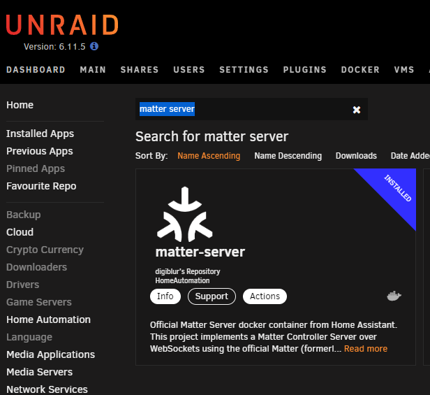

Home Assistant devs have released an official docker container to install the Matter Server necessary for the Matter integration in Home Assistant.  No more building your own container since you don't use HAOS!  The [Python-Matter-Server](https://github.com/home-assistant-libs/python-matter-server) repo is available on GitHub.  This allows you to integrate the various available and upcoming [Smart Home Matter devices](https://amzn.to/3pm86sB) with Home Assistant no matter what type installation method you use in your home.

Matter Devices - (https://amzn.to/3pm86sB)  *affiliate  
Matter Certified Device List - (https://csa-iot.org/csa-iot_products/)

## Full Video 

<iframe allowfullscreen height="353" src="https://www.youtube.com/embed/8a7ZUQqY2JA" width="625" youtube-src-=""></iframe>  

## Installation Methods

### UnRaid

Search for Matter Server in the UnRaid CA Apps store - follow the prompts to install the container and make sure it is set to Auto Start.



### Docker Compose

```yaml
version: '3'
services:
  matter-server:
    container_name: matter-server
    image: ghcr.io/home-assistant-libs/python-matter-server:stable
    restart: unless-stopped
    security_opt:
      - apparmor=unconfined
    volumes:
      - /opt/matter-server:/data
      - /run/dbus:/run/dbus:ro
    network_mode: host
```

### Docker Run

```
mkdir data
docker run -d \
  --name matter-server \
  --restart=unless-stopped \
  --security-opt apparmor=unconfined \
  -v $(pwd)/data:/data \
  -v /run/dbus:/run/dbus:ro \
  --network=host \
  ghcr.io/home-assistant-libs/python-matter-server:stable
```  


