### What is the Emporia Vue?

We've covered the Gen 2 model in the [previous video](https://youtu.be/z0Jv4nO9OWg), but in a quick TL;DR.  It's a box that goes in your breaker panel to measure the entire power usage in your home as well as breaking it down to 16 other circuits in your home for a more detailed usage.  This isn't any AI, or guess work involved like other brands, it measures the real world usage of each of the 16 circuits you install the clamps on in the breaker panel. 

Out of the box the unit is cloud only and feeds your data to another company for use!  That's not what we want, it's our electricity usage pattern data!  We want it in house and local! Luckily the Gen 3 contains an ESP32 just like the previous Gen 2 model.

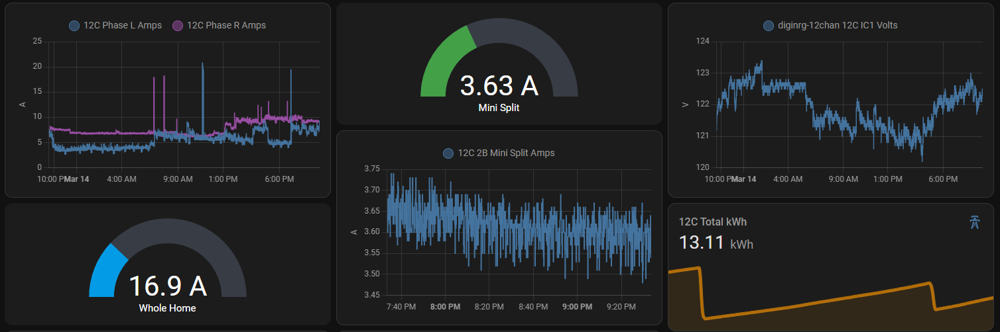

### What is the Gen 3 all about?

Purchase on Amazon (affiliate) - https://amzn.to/3wMOcKv  
Purchase from Emporia - https://shop.emporiaenergy.com/collections/in-panel-energy-monitors

**Pay attention to the models**, there are 3 packages with 0, 8, and 16 additional CT clamps included.  

As we stated above, the Gen 3 comes with an ESP32 again and actually the same power monitoring chips. They've only decreased the size in the board itself while changing all 2.5mm/3.5mm CT clamp plugs to Phoenix style plugs.  This means you can now easily cut your CT clamp plugs to length instead of having miles of extra wire to deal with.  Probably a good idea to [crimp ferrules](https://amzn.to/3x2U6Hr) on them again though after you cut them.  

Emporia also added an Ethenet connection, but I'm not comfortable nor do I think my local code allows low voltage to mix with high voltage.  I'll stick to Wi-Fi as the antenna is provided with the punchout plug to stick out of the metal panel.  


### Can I put ESPHome on it?

Read more  👉👇
<!--truncate-->

First you'll need to open it as there isn't a known OTA exploit at this time. There are 5 screws on the back.  You'll need to use a BDM frame or solder to the pads on the back.  It isn't that difficult, so pick your poison.  What's a BDM Frame?  [See here](https://digiblur.com/wiki/devices/plugs/wyze_plug_outdoor_wlppo1#how-to-flash-esphome-or-tasmota)

Cossid mapped out the ESP32 RX/TX pins for us below for use with a [USB TTL adapter](https://amzn.to/4903Yz4).  Thanks Cossid!

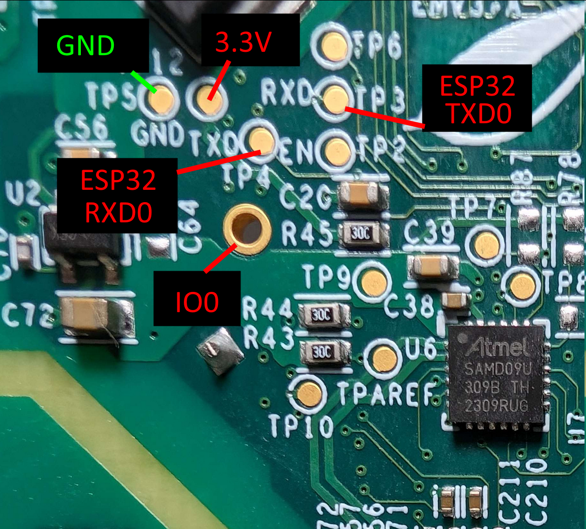

Keep in mind, do not transpose the RX/TX pins like you normally do.  RX goes to RX and TX goes to TX this time around.

I was able to trace down the I2C pins to the power monitoring chip but the same gen 2 ESPHome code for the sensors should work fine for the new Gen 3 model.  I've included my config below but you can find the ESPHome custom component code at https://github.com/emporia-vue-local/esphome

Note: The config below is missing the Ethernet controller and two LEDs.

#### ESPHome Code 

```yaml
esphome:
  name: emporiavue3

substitutions:
  display_name: EmpVu3

external_components:
#  - source: github://emporia-vue-local/esphome@dev
  - source: github://digiblur/esphome-vue3@dev
    components:
      - emporia_vue
      
esp32:
  board: esp32dev
  framework:
    type: esp-idf
    version: recommended

preferences:
  # the default of 1min is far too short--flash chip is rated
  # for approx 100k writes.
  flash_write_interval: "48h"   

api:
ota:
  platform: esphome

logger:
  logs:
    sensor: INFO

wifi:
  ssid: !secret wifi_ssid
  password: !secret wifi_password
  ap: 

captive_portal:

i2c:
  sda: 5
  scl: 18
  scan: false
  frequency: 200kHz  # recommended range is 50-200kHz
  id: i2c_a

switch:
  - platform: restart
    name: Restart  

time:
  - platform: sntp
    id: sntp_time    

# these are called references in YAML. They allow you to reuse
# this configuration in each sensor, while only defining it once
.defaultfilters:
  - &moving_avg
    # we capture a new sample every 0.24 seconds, so the time can
    # be calculated from the number of samples as n * 0.24.
    sliding_window_moving_average:
      # we average over the past 2.88 seconds
      window_size: 24
      # we push a new value every 1.44 seconds
      send_every: 12
  - &invert
    # invert and filter out any values below 0.
    lambda: 'return max(-x, 0.0f);'
  - &pos
    # filter out any values below 0.
    lambda: 'return max(x, 0.0f);'
  - &abs
    # take the absolute value of the value
    lambda: 'return abs(x);'

sensor:
  - platform: emporia_vue
    i2c_id: i2c_a
    phases:
      - id: phase_a  # Verify that this specific phase/leg is connected to correct input wire color on device listed below
        input: BLACK  # Vue device wire color
        calibration: 0.0194  # 0.022 is used as the default as starting point but may need adjusted to ensure accuracy
        # To calculate new calibration value use the formula <in-use calibration value> * <accurate voltage> / <reporting voltage>
        voltage:
          name: "Phase R Voltage"
          filters: [*pos, *pos]
      - id: phase_b  # Verify that this specific phase/leg is connected to correct input wire color on device listed below
        input: RED  # Vue device wire color
        calibration: 0.0194  # 0.022 is used as the default as starting point but may need adjusted to ensure accuracy
        # To calculate new calibration value use the formula <in-use calibration value> * <accurate voltage> / <reporting voltage>
        voltage:
          name: "Phase L Voltage"
          filters: [*moving_avg, *pos]
    ct_clamps:
      - phase_id: phase_a
        input: "A"  # Verify the CT going to this device input also matches the phase/leg
        power:
          name: "Phase R Power"
          id: phase_a_power
          device_class: power
          filters: [*moving_avg, *pos]
      - phase_id: phase_b
        input: "B"  # Verify the CT going to this device input also matches the phase/leg
        power:
          name: "Phase L Power"
          id: phase_b_power
          device_class: power
          filters: [*moving_avg, *pos]
      # Pay close attention to set the phase_id for each breaker by matching it to the phase/leg it connects to in the panel
      - { phase_id: phase_a, input:  "1", power: { name:  "Circuit 1 Power", id:  cir1, filters: [ *moving_avg, *pos ] } }
      - { phase_id: phase_b, input:  "2", power: { name:  "Circuit 2 Power", id:  cir2, filters: [ *moving_avg, *pos ] } }
      - { phase_id: phase_b, input:  "3", power: { name:  "Circuit 3 Power", id:  cir3, filters: [ *moving_avg, *pos ] } }
      - { phase_id: phase_b, input:  "4", power: { name:  "Circuit 4 Power", id:  cir4, filters: [ *moving_avg, *pos ] } }
#      - { phase_id: phase_a, input:  "5", power: { name:  "Circuit 5 Power", id:  cir5, filters: [ *moving_avg, *pos, multiply: 2 ] } }
      - { phase_id: phase_a, input:  "5", power: { name:  "Circuit 5 Power", id:  cir5, filters: [ *moving_avg, *pos ] } }
      - { phase_id: phase_b, input:  "6", power: { name:  "Circuit 6 Power", id:  cir6, filters: [ *moving_avg, *pos ] } }
      - { phase_id: phase_b, input:  "7", power: { name:  "Circuit 7 Power", id:  cir7, filters: [ *moving_avg, *pos ] } }
      - { phase_id: phase_b, input:  "8", power: { name:  "Circuit 8 Power", id:  cir8, filters: [ *moving_avg, *pos ] } }
#      - { phase_id: phase_a, input:  "9", power: { name:  "Circuit 9 Power", id:  cir9, filters: [ *moving_avg, *pos ] } }
#      - { phase_id: phase_b, input: "10", power: { name: "Circuit 10 Power", id: cir10, filters: [ *moving_avg, *pos ] } }
#      - { phase_id: phase_a, input: "11", power: { name: "Circuit 11 Power", id: cir11, filters: [ *moving_avg, *pos ] } }
#      - { phase_id: phase_a, input: "12", power: { name: "Circuit 12 Power", id: cir12, filters: [ *moving_avg, *pos ] } }
#      - { phase_id: phase_a, input: "13", power: { name: "Circuit 13 Power", id: cir13, filters: [ *moving_avg, *pos ] } }
#      - { phase_id: phase_a, input: "14", power: { name: "Circuit 14 Power", id: cir14, filters: [ *moving_avg, *pos ] } }
#      - { phase_id: phase_b, input: "15", power: { name: "Circuit 15 Power", id: cir15, filters: [ *moving_avg, *pos ] } }
#      - { phase_id: phase_a, input: "16", power: { name: "Circuit 16 Power", id: cir16, filters: [ *moving_avg, *pos ] } }
  - platform: template
    name: "Total Power"
    lambda: return id(phase_a_power).state + id(phase_b_power).state;
    update_interval: 10s
    id: total_power
    unit_of_measurement: "W"
  - platform: total_daily_energy
    name: "Total Daily Energy"
    power_id: total_power
    accuracy_decimals: 0
  - { power_id:  cir1, platform: total_daily_energy, accuracy_decimals: 0, name:  "Circuit 1 Daily Energy" }
  - { power_id:  cir2, platform: total_daily_energy, accuracy_decimals: 0, name:  "Circuit 2 Daily Energy" }
  - { power_id:  cir3, platform: total_daily_energy, accuracy_decimals: 0, name:  "Circuit 3 Daily Energy" }
  - { power_id:  cir4, platform: total_daily_energy, accuracy_decimals: 0, name:  "Circuit 4 Daily Energy" }
  - { power_id:  cir5, platform: total_daily_energy, accuracy_decimals: 0, name:  "Circuit 5 Daily Energy" }
  - { power_id:  cir6, platform: total_daily_energy, accuracy_decimals: 0, name:  "Circuit 6 Daily Energy" }
  - { power_id:  cir7, platform: total_daily_energy, accuracy_decimals: 0, name:  "Circuit 7 Daily Energy" }
  - { power_id:  cir8, platform: total_daily_energy, accuracy_decimals: 0, name:  "Circuit 8 Daily Energy" }
#  - { power_id:  cir9, platform: total_daily_energy, accuracy_decimals: 0, name:  "Circuit 9 Daily Energy" }
#  - { power_id: cir10, platform: total_daily_energy, accuracy_decimals: 0, name: "Circuit 10 Daily Energy" }
#  - { power_id: cir11, platform: total_daily_energy, accuracy_decimals: 0, name: "Circuit 11 Daily Energy" }
#  - { power_id: cir12, platform: total_daily_energy, accuracy_decimals: 0, name: "Circuit 12 Daily Energy" }
#  - { power_id: cir13, platform: total_daily_energy, accuracy_decimals: 0, name: "Circuit 13 Daily Energy" }
#  - { power_id: cir14, platform: total_daily_energy, accuracy_decimals: 0, name: "Circuit 14 Daily Energy" }
#  - { power_id: cir15, platform: total_daily_energy, accuracy_decimals: 0, name: "Circuit 15 Daily Energy" }
#  - { power_id: cir16, platform: total_daily_energy, accuracy_decimals: 0, name: "Circuit 16 Daily Energy" }
```

### Additional Pictures

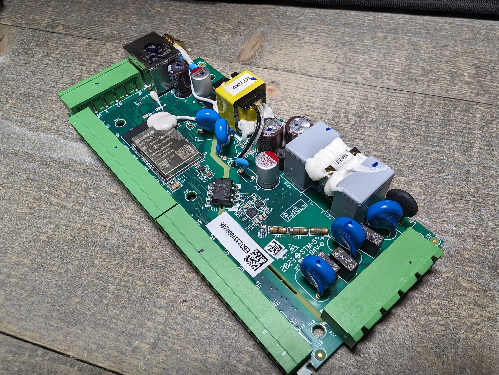

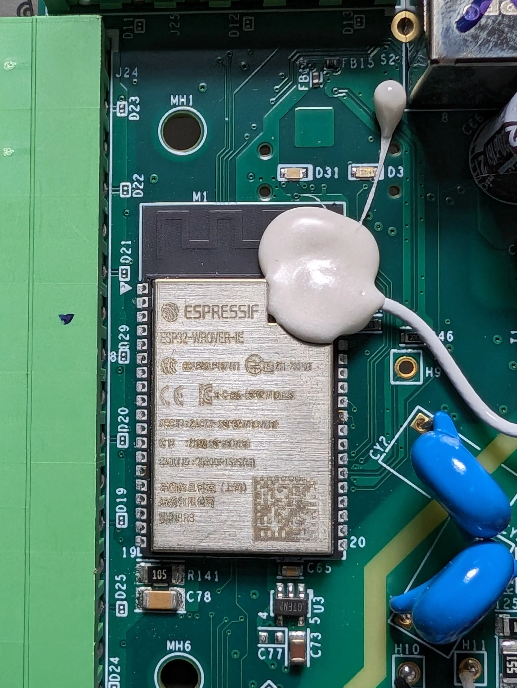

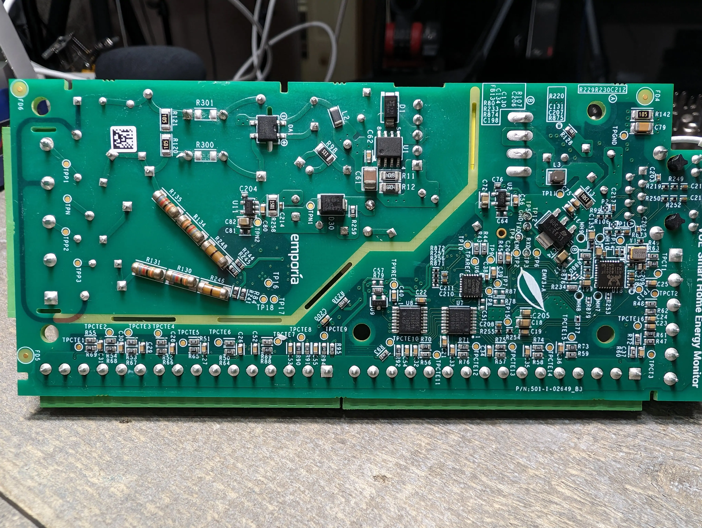

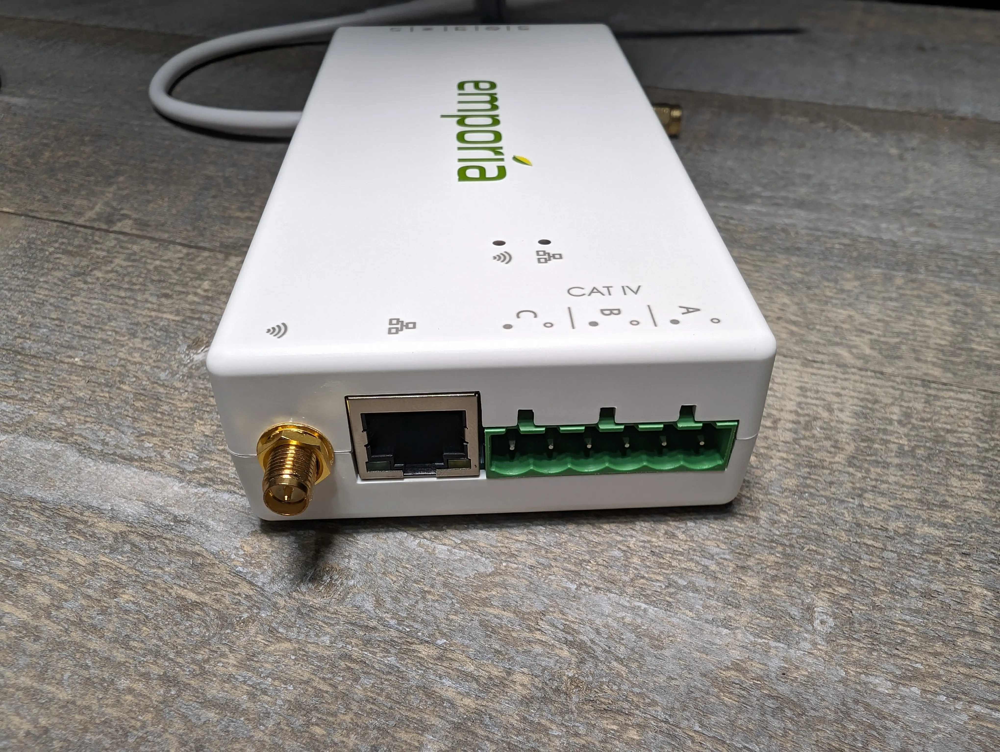


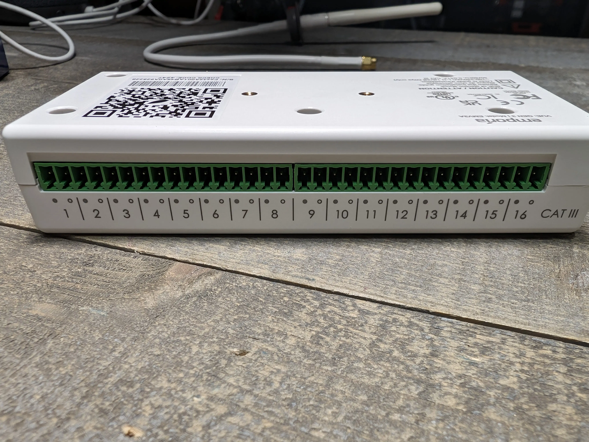

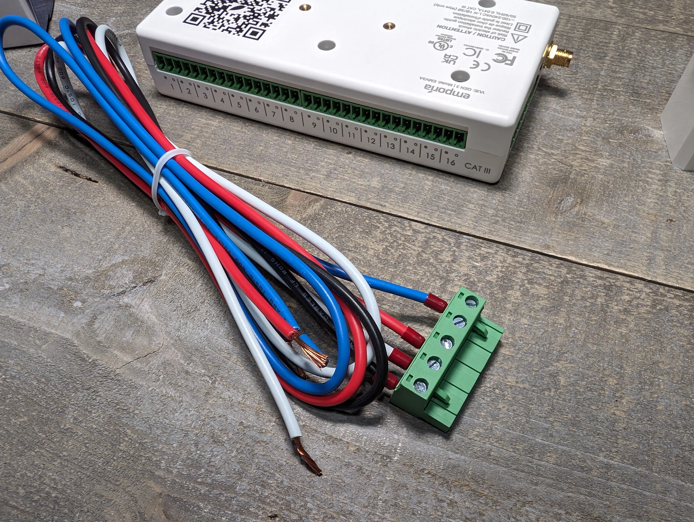

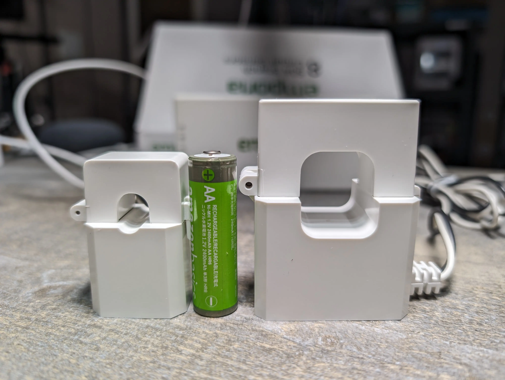


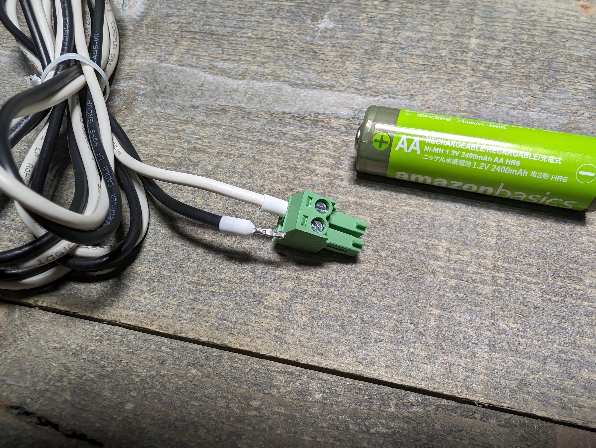

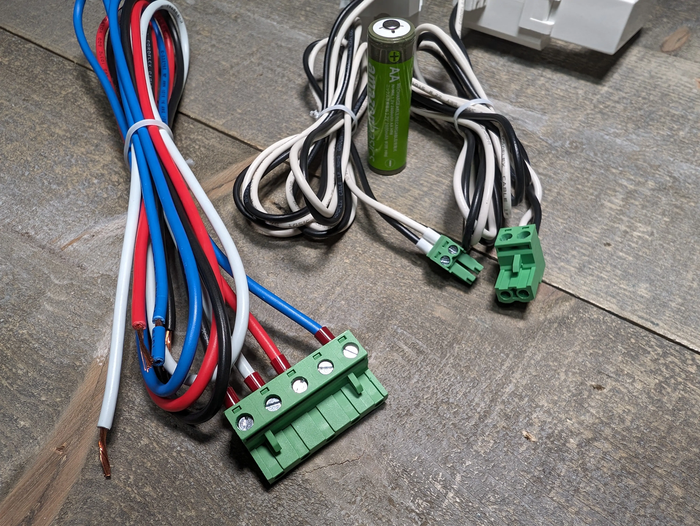

Purchase on Amazon (affiliate) - https://amzn.to/3wMOcKv  
Purchase from Emporia - https://shop.emporiaenergy.com/collections/in-panel-energy-monitors

### Additional Info

Join us in the #device forums on the [digiblurDIY Discord](https://digiblur.discord.com) or the [Gen3 Discussion Thread](https://github.com/emporia-vue-local/esphome/discussions/264) on Github.